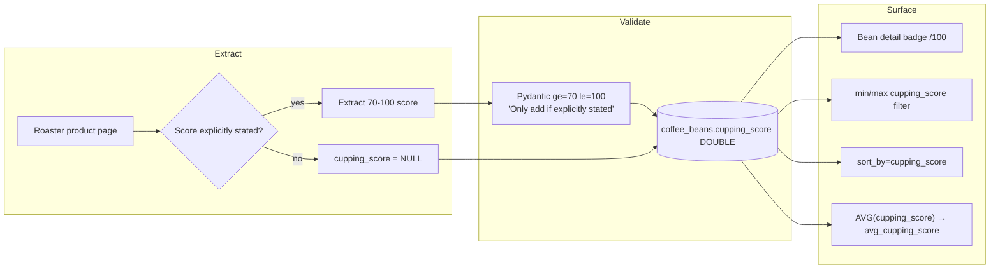

# Cupping Scores & SCA Scoring

Cupping is the standardised sensory evaluation method used by the coffee industry to grade green and roasted coffee objectively. Kissaten captures a single numeric `cupping_score` per bean, exposes it as a first-class facet for filtering, sorting, and aggregation, and guards it against fabrication so that only explicitly published scores enter the catalogue.

## The SCA cupping protocol

The Specialty Coffee Association (SCA) cupping protocol evaluates a coffee across ten attributes, each scored on a defined scale and summed to a total on a 100-point scale:

- **Fragrance / Aroma** — the dry-ground fragrance and wet-crust aroma.
- **Flavour** — the principal taste impression in the cup.
- **Aftertaste** — length and quality of the finish.
- **Acidity** — intensity and quality (brightness), not merely strength.
- **Body** — mouthfeel, weight, and texture.
- **Balance** — how well the cup's attributes complement one another.
- **Uniformity** — consistency across cups in the flight.
- **Clean Cup** — absence of taints or defects.
- **Sweetness** — perceived sweetness across the cup.
- **Overall** — the cupper's holistic assessment of the coffee.

A coffee must score **80 points or above** to qualify as **specialty** coffee under the SCA definition. Cupping is therefore the quality gate that separates specialty-grade coffees from commercial/exchange-grade stock. Because cupping evaluates flavour directly, the score is conceptually adjacent to the flavour descriptors captured in [tasting-note-taxonomy.md](/openwiki/concepts/tasting-note-taxonomy.md); it is also influenced by how the coffee was roasted, as discussed in [roast-levels-profiles.md](/openwiki/concepts/roast-levels-profiles.md).

## SCA quality bands and what they mean

The 100-point total is conventionally read against the following quality bands:

| Score range | Quality classification |
|-------------|-------------------------|
| **80.00–84.99** | Very good — solid specialty coffee, above commercial grade. |
| **85.00–89.99** | Excellent — clearly distinctive and high quality. |
| **90.00–94.99** | Outstanding — exceptional coffees with notable complexity. |
| **95.00–100.00** | Exceptional / transcendent — rare, world-class lots. |

Anything below 80 does not qualify as specialty. These bands contextualise the raw number when it is displayed to users: an 86.5 is meaningfully different from an 81.0, and a 92 represents a genuinely rare lot.

## How Kissaten models `cupping_score`

### Bean-level field

Each `CoffeeBean` carries an optional `cupping_score`:

```python
cupping_score: float | None = Field(
    None, ge=70, le=100, description="Cupping score (70-100). Only add if explicitly stated"
)
```

Two design choices matter:

1. **Constrained to 70–100.** Pydantic enforces `ge=70, le=100`. The lower bound of 70 sits below the 80-point specialty threshold, allowing the model to record a published sub-specialty score when a roaster cites one, while the upper bound of 100 matches the SCA ceiling. Scores outside this range fail validation.
2. **Only added when explicitly stated.** The field description — repeated verbatim across the canonical `CoffeeBean`, the AI extraction prompt, and the bean data format spec — instructs extractors to record a score **only if explicitly mentioned** and never to estimate it. This prevents fabricated scores from polluting a field that users treat as a quality signal.

The same constraint and instruction appear on the diff-update model and the v0 legacy schema, keeping the contract consistent across create, partial-update, and historical import paths. At the persistence layer the column is a nullable `DOUBLE`:

```sql
cupping_score DOUBLE,
```

so beans without a published score simply store `NULL`.

### Why "explicitly stated" matters

Roasters rarely publish a formal SCA cupping score for every bag; many omit it entirely. Because the score is surfaced as a sort key and a roaster-level average (both below), an estimated or hallucinated value would distort rankings and aggregates. The extraction prompt therefore states the rule explicitly:

> `cupping_score`: Score between 70-100, only if explicitly mentioned (do not estimate)

This keeps `cupping_score` a *known-published* signal rather than a guess, at the cost of sparse coverage — most beans legitimately have `NULL`.

## Where the score appears

### Bean detail page

On the bean detail page the score is rendered as a star-rated badge, shown only when present and greater than zero:

```svelte
{#if bean?.cupping_score && bean?.cupping_score > 0}
  ... {bean?.cupping_score}/100
{/if}
```

It appears both in the page header and in structured metadata sections, giving the raw number a `/100` suffix so the 100-point SCA context is clear. See [bean-detail-page.md](/openwiki/design/bean-detail-page.md). The card component (`CoffeeBeanCard.svelte`) renders the same star badge on listing surfaces.

### Search: filtering by score

The search API exposes `min_cupping_score` / `max_cupping_score` query parameters (documented as a 0–100 range filter) which flow into a `FilterParams` range filter applied against `cb.cupping_score`:

```python
add_range_filter(filter_params.min_cupping_score, filter_params.max_cupping_score, "cb.cupping_score")
```

This lets users restrict results to, for example, 86+ lots. When a cupping-score range filter is active it also contributes to the relevance scoring with its own configurable weight (`weights.cupping_score`). See [faceted-filtering.md](/openwiki/design/faceted-filtering.md) and [backend-api.md](/openwiki/api/backend-api.md).

### Search: sorting by score

`cupping_score` is a first-class sort key. It is mapped to the SQL column in the sort field map:

```python
"cupping_score": "sb.cupping_score",
```

and is accepted by the public `sort_by` `Literal` on the bean search endpoints, as well as in the AI search schema's `sort_by` field (default `"date_added"`):

```python
sort_by: str = Field(
    "date_added",
    description="Field to sort by (e.g., 'date_added', 'price', 'price_large', 'name', 'cupping_score', 'relevance'). ...",
)
```

The AI search agent maps natural-language intent such as *"best rated first"* to `sort_by: "cupping_score", sort_order: "desc"`. On the frontend, the faceted filter panel and the results sort dropdown both offer a labelled "Cupping Score" option bound to this key. See [data-model.md](/openwiki/data/data-model.md) for the field's place in the overall bean model.

### Roaster-level aggregate

At the roaster level, Kissaten computes an average cupping score across all of a roaster's beans and exposes it as `avg_cupping_score` inside `RoasterStatistics`, carried by `RoasterDetailResponse`:

```python
class RoasterStatistics(BaseModel):
    ...
    avg_cupping_score: Optional[float] = None
    avg_price_usd: Optional[float] = None
```

The aggregate is computed in SQL via `AVG(cupping_score)`, which transparently ignores `NULL` rows — so a roaster with many unscored beans still reports a fair average over the beans that *do* carry a published score. If no beans for the roaster have a score, `avg_cupping_score` is `None`. This roaster-level view complements the roaster uniqueness analysis described in [roaster-uniqueness.md](/openwiki/api/roaster-uniqueness.md).

## Summary of the data flow



## Invariants and failure semantics

- **Range invariant:** any non-null `cupping_score` is between 70 and 100 inclusive, enforced at the Pydantic boundary before persistence. Out-of-range values raise validation errors and are rejected.
- **Provenance invariant:** the score must originate from an explicit statement on the product page; estimation is explicitly forbidden in the extraction prompt. Absence of a statement yields `NULL`, not a guess.
- **NULL tolerance:** filtering, sorting, and the roaster average all treat `NULL` scores as "not applicable" rather than zero. `AVG` ignores nulls; sort order places nulls per the SQL engine's null-ordering rather than coercing them to 70.
- **No upper-bound inflation:** because the ceiling is 100, the field cannot represent scores above the SCA scale even if a roaster markets a coffee with a non-standard >100 figure.

These guarantees make `cupping_score` safe to use as a public quality signal: when it is present, it is a real, in-range, published number; when it is absent, nothing is silently fabricated to fill the gap.
