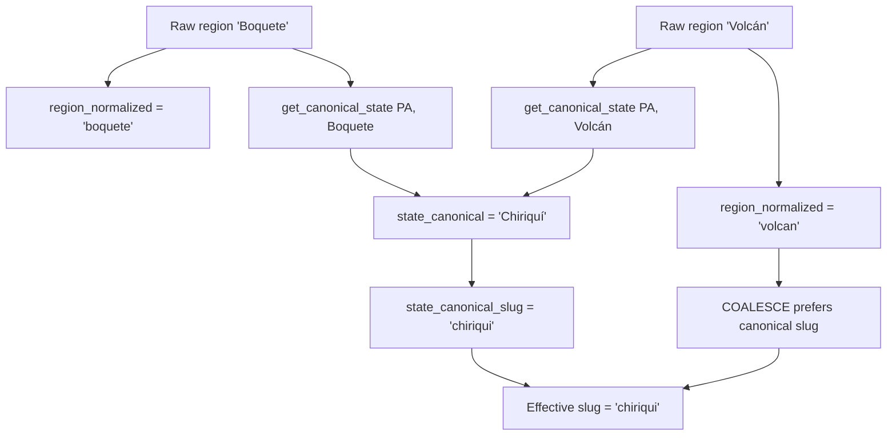

# Origin Geography & the Coffee Belt

Where a coffee grows shapes almost everything else about it: which [varietals](./varietals.md) thrive, which [processing methods](./processing-methods.md) are traditional, how dense the bean is, and which flavours emerge after roasting. Kissaten models origin as a first-class, three-level geographical hierarchy and exposes it through a dedicated API and frontend route. This page covers the domain (the coffee belt, elevation, traceability) and the implementation that keeps the hierarchy consistent: the `origins[]` bean array, the `origins` DuckDB table, the canonical region-slug grouping invariant, the geocoding pipeline, and the `/v1/origins/...` endpoint and route tree.

## The coffee belt

Coffee arabica grows in a narrow equatorial band known as the **coffee belt**, roughly **25°N to 25°S** of the equator. Within this band the crop needs stable temperatures, distinct wet/dry seasons, and — for the best quality — significant elevation. The belt spans parts of Africa, the Arabian peninsula, the Indian subcontinent, Southeast Asia, and Central and South America.

Kissaten's `region_mappings/` directory holds geocoding-derived canonical-state mappings for **48 coffee-producing (and a few consuming) countries**, including the major origins represented in the dataset: **Ethiopia (`ET`)**, **Colombia (`CO`)**, **Brazil (`BR`)**, **Kenya (`KE`)**, **Guatemala (`GT`)**, **Panama (`PA`)**, **Costa Rica (`CR`)**, **Honduras (`HN`)**, **El Salvador (`SV`)**, **Nicaragua (`NI`)**, **Mexico (`MX`)**, **Peru (`PE`)**, **Ecuador (`EC`)**, **Bolivia (`BO`)**, **Rwanda (`RW`)**, **Burundi (`BI`)**, **Uganda (`UG`)**, **Tanzania (`TZ`)**, **Yemen (`YE`)**, **India (`IN`)**, **Indonesia (`ID`)**, **Vietnam (`VN`)**, **Papua New Guinea (`PG`)**, and others. Each mapping file is keyed by the raw region strings scraped from roaster pages and resolves them to a canonical sub-national state (see [Region mappings and geocoding](#region-mappings-and-geocoding)).

## The three-level hierarchy: Country → Region → Farm

Kissaten organises origin data in a strict three-level hierarchy:

1. **Country** — identified by an **ISO 3166-1 alpha-2 code** (e.g. `CO` for Colombia, `ET` for Ethiopia, `KE` for Kenya). The `Bean.country` field stores this two-letter code, validated and upper-cased by `clean_country`.
2. **Region** — a sub-national administrative area (e.g. Antioquia, Huila, Sidama, Chiriquí). Captured as `Bean.region`, title-cased by `clean_region`. At query time regions are grouped by their *canonical state* (see below), so raw variants like "Boquete" and "Volcán" collapse into one "Chiriquí" entry.
3. **Farm** — a specific production site, optionally with a named **producer** (`Bean.farm`, `Bean.producer`). Farms are the most granular traceability unit; "Unknown Farm" is a synthetic bucket for beans whose farm name was not captured.

The `Bean` Pydantic model (the per-origin element of `CoffeeBean.origins[]`) captures all three levels plus the environmental and cost-transparency fields that vary per origin/lot:

```python
country: str | None          # ISO 3166-1 alpha-2, upper-cased
region: str | None           # sub-national area, title-cased
producer: str | None         # person name
farm: str | None             # farm name
elevation_min: int           # 0–3000 m, 0 if unknown
elevation_max: int           # 0–3000 m, 0 if unknown
latitude: float | None       # -90..90, "Do not guess"
longitude: float | None      # -180..180, "Do not guess"
process: str | None          # → see processing-methods.md
variety: str | None           # → see varietals.md
harvest_date: datetime | None
fob_price / farm_gate_price / price_paid_to_producer / price_currency / importer_name
```

A `CoffeeBean` carries an `origins: list[Bean]` array rather than a single origin, so **blends** can list each constituent origin/lot independently. Single-origin coffees have exactly one entry. The `origins` array cannot be updated via diffjson — changing origin data requires a full bean JSON file.

### The `origins` DuckDB table

At load time each `Bean` in `origins[]` becomes a row in the **`origins`** DuckDB table, linked back to its parent bean via `bean_id` (with a foreign key to `coffee_beans.id`). The table stores the raw scraped values plus a set of **pre-computed normalised and canonical columns** used for deduplication and fast querying:

| Column | Purpose |
|---|---|
| `region`, `farm`, `producer`, `country` | Raw scraped values |
| `region_normalized` | `normalize_region_name(region)` — slug form of the raw region |
| `farm_normalized` | `normalize_farm_name(farm)` — slug form of the raw farm |
| `state_canonical` | Canonical state name from `get_canonical_state(country, region)` (geocoding mapping) |
| `state_canonical_slug` | `normalize_region_name(state_canonical)` — slug form of the canonical state |
| `farm_canonical` | Canonical farm display name from `get_canonical_farm(...)` |
| `latitude`, `longitude`, `elevation_min`, `elevation_max` | Environmental data |
| `process`, `process_common_name`, `variety`, `variety_canonical` | Cross-links to processing/varietal domains |

The normalisation helpers (`normalize_region_name`, `normalize_farm_name`, `normalize_process_name`, `normalize_varietal_name`) all follow the same recipe: Unicode NFKD decomposition → drop non-ASCII diacritics → lowercase → keep alphanumerics, spaces, and hyphens → collapse runs of spaces/hyphens into single hyphens. They are registered as DuckDB UDFs so SQL can call them directly during loading and query normalisation.

## Elevation and why it matters

Elevation is one of the strongest predictors of cup quality. **Higher elevation** means cooler nights and slower cherry maturation, which produces a **denser bean** with **more complex acidity** and greater flavour clarity. Specialty arabica typically grows above ~1,000 m, with the most prized lots at 1,500–2,200 m. Lower, hotter elevations mature faster and yield softer, less complex cups.

Kissaten captures elevation as a min/max range per origin (`elevation_min`/`elevation_max`, 0–3,000 m, 0 meaning "not known"). The range is aggregated at every hierarchy level:

- **Country detail** surfaces `avg_elevation` and an `elevation_distribution` (`ElevationInfo` with min/max/avg).
- **Region list** computes a `median_elevation` per region.
- **Region detail** returns an `elevation_range` (`ElevationInfo`).
- **Farm detail** returns `elevation_min`/`elevation_max` for the farm.

The frontend renders these with the **`ElevationMountainChart`** component on the country, region, and farm pages, turning the numeric range into a visual elevation profile.

## Coordinates: captured for the map, never guessed

`latitude` and `longitude` are optional per-origin fields used to plot farms on the origin map. The `Bean` model constrains them to valid ranges (`-90..90` / `-180..180`) and, critically, marks both with the instruction **"Do not guess. If not present, return None."** This is a deliberate data-quality rule: **an incorrect coordinate is worse than a missing one**. A wrong pin misleads users exploring the map and corrupts any downstream geographic aggregation, whereas a missing coordinate simply omits the farm from the map without lying about its position. Scrapers and the AI extractor are expected to return `None` rather than infer a coordinate from the region or country.

At the farm-detail level, coordinates are averaged across the farm's origin rows (`AVG(latitude)`, `AVG(longitude)`) and returned as the farm's `latitude`/`longitude` in `FarmDetailResponse`.

## Region mappings and geocoding

Raw region strings scraped from roaster pages are noisy: "Sidama", "Sidamo", and "Sidama Bensa" may all refer to the same Ethiopian state; "Boquete" and "Volcán" are both within Panama's Chiriquí province. Kissaten resolves this with a **geocoding + canonical-mapping pipeline**.

### The geocoding pipeline

`src/kissaten/services/geocoding.py` defines `OpenCageGeocoder`, a client for the **OpenCage geocoding API**:

- Requires an `OPENCAGE_API_KEY` (env var or constructor arg); raises if absent.
- Queries `https://api.opencagedata.com/geocode/v1/json` with the region + ISO country code, `countrycode` filter, and `limit=5` candidate results.
- Caches **full API responses** to a file cache under `data/geocoding_cache/{CC}/{normalized_region}.json`, keyed by the same NFKD/strip/lowercase/hyphenate normalisation used elsewhere. Cache hits avoid repeat API calls.
- Retries on HTTP 429 with exponential backoff (up to 3 retries).
- `extract_state_name()` reads the top result's components and returns the state-level name with priority **state → state_district → province → county**.
- `extract_metadata()` preserves all OpenCage component fields (ISO codes, bounds, geometry, etc.) for future use.

The `scripts/deduplicate_regions.py` script drives the pipeline: it queries distinct raw regions for a country, geocodes each via `OpenCageGeocoder`, uses a Gemini-backed `RegionSelector` to pick the best state-level result, and writes the resulting `canonical_state` (plus metadata) into `src/kissaten/database/region_mappings/{CC}.json`.

### The region mapping files

`src/kissaten/database/region_mappings/` contains **48 country JSON files** (e.g. `PA.json`, `ET.json`, `CO.json`). Each file maps raw region strings to a canonical state and the full geocoding metadata:

```json
{
  "Boquete": {
    "canonical_state": "Chiriquí",
    "confidence": 0.7,
    "iso_3166_2": "PA-4",
    "state": "Chiriquí",
    "geometry": { "lat": 8.74, "lng": -82.39 },
    "bounds": { ... }
  },
  "Volcán": { "canonical_state": "Chiriquí", ... }
}
```

At startup `load_region_mappings()` reads every `*.json` in that directory into the `_region_mappings` dict, keyed by upper-cased country code. The `get_canonical_state(country_code, region_name)` UDF performs the lookup: if the country has a mapping and the raw region is present, it returns the `canonical_state` (or `None` for explicitly invalid/failed regions, preserving NULL); otherwise it returns the original region name. During data loading, each origins row is backfilled with `state_canonical = get_canonical_state(country, region)` and `state_canonical_slug = normalize_region_name(state_canonical)`.

## The canonical region-slug grouping invariant

This is the single most important correctness rule in the origin endpoints. When a region is geocoded, its `state_canonical` (e.g. "Chiriquí") may differ from the raw `region` string (e.g. "Boquete", "Volcán"), and **multiple raw regions map to one canonical state**. Every endpoint that identifies a region must therefore use the **same effective-slug expression**:

```sql
COALESCE(o.state_canonical_slug, o.region_normalized)
-- equivalent to: COALESCE(normalize_region_name(o.state_canonical), o.region_normalized)
```

`state_canonical_slug` is the pre-computed `normalize_region_name(state_canonical)`; `region_normalized` is the pre-computed `normalize_region_name(region)`. The COALESCE picks the canonical slug when the row has been geocoded, falling back to the raw slug otherwise. This "effective slug" is what appears in URLs and what every region filter matches against.



Both "Boquete" and "Volcán" rows resolve to effective slug `chiriqui`, so the regions-list `GROUP BY` merges them into one "Chiriquí" entry and the raw slugs `boquete`/`volcan` are no longer independently addressable.

### Why OR-based filters leak (and must not be used)

A previous implementation matched regions with:

```sql
WHERE normalize_region_name(o.state_canonical) = ? OR o.region_normalized = ?
```

This causes **slug leaks**. Example: querying `sidama-bensa`:

- Rows with `region='Sidama Bensa'` have `region_normalized='sidama-bensa'` but `state_canonical='Sidama'` (effective slug `'sidama'`).
- The `OR` matched these rows on `region_normalized='sidama-bensa'`, even though their canonical group is `'sidama'`.
- Result: 55 beans returned instead of the correct 7.

The COALESCE-based filter evaluates each row's *effective* slug once, so only rows that truly belong to the requested group match. The region-detail and farm-detail endpoints therefore use:

```sql
WHERE o.country = ? AND COALESCE(o.state_canonical_slug, o.region_normalized) = ?
```

### Cross-region data leak prevention

Region-detail builds a temp table of matching `bean_id`s, then runs **six** sub-queries (stats, known farms, unknown farms, varietals, processes, elevation) that re-join `origins o ON t.bean_id = o.bean_id`. Because a bean can have origins in multiple regions, **every one of these joins must re-apply the region filter** (`AND {region_filter_sql}` with params). Omitting it on even one sub-query leaks data from other regions into the response. The implementation threads `region_filter_sql` and `filter_params` through all six joins.

### Farm count consistency

Farm counts use an identical expression in list and detail endpoints so the numbers reconcile:

```sql
COUNT(DISTINCT COALESCE(o.farm_canonical, o.farm_normalized))
    FILTER (WHERE o.farm IS NOT NULL AND o.farm != '')
```

`farm_normalized` (not raw `farm`) is the COALESCE fallback for stable deduplication, and the `FILTER` excludes unnamed farms. The synthetic "Unknown Farm" bucket in region-detail is therefore **not** counted in `farm_count`/`total_farms`, keeping list and detail counts consistent.

## The `/v1/origins` API hierarchy

The origin endpoints form a strict hierarchy mirroring Country → Region → Farm. All are cached with `SimpleMemoryCache` and backed by DuckDB queries against the `origins` table.

| Endpoint | Returns | Key grouping / filter |
|---|---|---|
| `GET /v1/origins` | Country list with bean + roaster counts | `GROUP BY o.country` |
| `GET /v1/origins/{country_code}` | `CountryDetailResponse` (stats, top regions, roasters, notes, varietals, processes, elevation) | `WHERE o.country = ?` |
| `GET /v1/origins/{country_code}/regions` | `list[RegionSummary]` (name, bean/farm counts, `is_geocoded`, `median_elevation`) | `GROUP BY COALESCE(o.state_canonical_slug, o.region_normalized)` |
| `GET /v1/origins/{country_code}/{region_slug}` | `RegionDetailResponse` (farms, roasters, notes, varietals, processes, elevation range, `is_geocoded`) | `WHERE ... COALESCE(o.state_canonical_slug, o.region_normalized) = ?` |
| `GET /v1/origins/{country_code}/{region_slug}/{farm_slug}` | `FarmDetailResponse` (beans, producers, lat/lon, elevation, varietals, processes, notes) | Same region filter + `normalize_farm_name(o.farm_canonical) = ? OR o.farm_normalized = ?` |

Country and region codes are normalised on entry (`country_code.upper()`, `region_slug.lower()`). The special slugs `unknown-region` and `unknown-farm` match rows where the region/farm is NULL or empty, so beans with missing origin data remain reachable rather than silently dropped. Unknown regions with beans are also appended as a single "Unknown Region" entry to the regions list.

The country- and region-detail endpoints materialise a per-request **temporary table** (`_country_beans_<id>`, `_region_beans_<id>`, `_farm_beans_<id>`) from the single slow scan, then run all subsequent aggregation queries against it for performance, and drop the temp table in a `finally` block.

Display names prefer the canonical state name via `MODE(state_canonical) FILTER (...)`, falling back to `MODE(region)`, so a grouped "Chiriquí" entry shows "Chiriquí" rather than whichever raw variant happened to be most frequent.

### Consistency invariants (enforced by tests)

The test suite pins the cross-level consistency the hierarchy depends on:

- **Country list ↔ detail**: `bean_count`/`roaster_count` in the list equal `total_beans`/`total_roasters` in the detail.
- **Region list ↔ detail**: `bean_count`/`farm_count` in the list equal `total_beans`/`total_farms` in the detail.
- **No duplicate region names**; `normalize_region_name(region_name)` from the list resolves to the same name in the detail (name round-trip).
- **No region exceeds country**; no farm's `bean_count` exceeds its region's `total_beans`.
- **Canonical slug exclusivity**: raw slugs subsumed into a canonical group do not appear as independent entries, and querying a subsumed raw slug does not return the canonical group's data (no slug leak).
- **Farm-detail respects grouping**: the farm endpoint's region filter uses the same COALESCE expression.

These are covered by `tests/test_origin_hierarchy_counts.py`, `tests/test_region_name_consistency.py`, `tests/test_canonical_slug_grouping.py`, `tests/test_origins_api.py`, and `tests/test_invalid_regions.py`.

## Frontend origins route

The frontend mirrors the API hierarchy as a SvelteKit route tree under `frontend/src/routes/(main)/origins/`:

```
origins/                                          → all countries (UniversalOriginSearch)
origins/[country_code]/                           → country detail (regions list)
origins/[country_code]/[region_slug]/             → region detail (farms list)
origins/[country_code]/[region_slug]/[farm_slug]/ → farm detail (beans list)
```

Each level loads its data via the `/api/v1/origins/...` endpoints (proxied to the backend) and renders:

- **`GeographyBreadcrumb`** — a breadcrumb letting users step back up the hierarchy (country → region → farm), imported on all three detail pages.
- **`ElevationMountainChart`** — the elevation visualisation component, used on country, region, and farm pages to render the elevation range as a mountain profile.
- **`UniversalOriginSearch`** — a unified search that searches across countries, regions, and farms, with `defaultResults` derived from the current level's list.
- **`InsightCard`** sections — top varietals, processing methods, and tasting notes, each linking out to the dedicated `/varietals/{slug}`, `/processes/{slug}`, or `/search` pages with the origin context pre-applied as a filter.

The frontend implements **parallel normalisation** (`normalizeRegionName`, `normalizeFarmName` in `frontend/src/lib/utils.ts`) so that URL slugs it generates for breadcrumbs and links match the slugs the backend expects. See [design/origin-exploration.md](../design/origin-exploration.md) for the full UX design of this drill-down flow.

## Relationships to other domains

Origin geography is the backbone that other domain concepts hang off:

- **Processing methods** (`process`, `process_common_name`) — traditional methods vary by origin (e.g. natural processing in Brazil and Ethiopia, washed in Colombia and Kenya). See [processing-methods.md](./processing-methods.md).
- **Varietals** (`variety`, `variety_canonical`) — varietal prevalence is strongly origin-dependent (e.g. Bourbon and Typica descendants across Latin America, Ethiopian heirloom landraces). See [varietals.md](./varietals.md).
- **Roast levels** — origin bean density influences how a roaster approaches the roast; see [roast-levels-profiles.md](./roast-levels-profiles.md).

The data model that owns the `origins[]` array and the `origins` table is documented in [data/data-model.md](../data/data-model.md), and the full backend API surface (including the `/v1/search/origins` unified search) in [api/backend-api.md](../api/backend-api.md).
