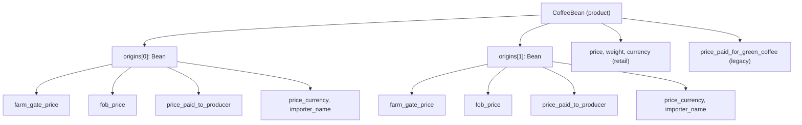

# Price Transparency Fields

Specialty coffee buyers increasingly expect roasters to disclose what they actually paid the people who grew the coffee. Kissaten captures this as a set of **cost transparency fields** on each per-origin record, distinct from the roasted retail price a consumer pays for a bag. This page explains the three supply-chain price points the model records, why they live per-origin, how they are validated, and how they relate to the retail pricing and FX normalization pipeline. Transparency is fundamentally per-origin — see [Origin Geography & the Coffee Belt](origin-geography.md) for the country→region→farm hierarchy these prices attach to.

## The three supply-chain price points

Green coffee passes through several hands before it reaches a roaster, and each hand takes a margin. Capturing the price at multiple points in the chain is what lets a buyer judge whether a "transparent" or "direct trade" claim is meaningful. Kissaten records three prices, all expressed as **per-kg in USD**:

| Field | Meaning | Supply-chain stage |
|---|---|---|
| `farm_gate_price` | Price paid at the farm, before transport and processing | The farmer's gate — the earliest, most producer-favourable point |
| `fob_price` | Free On Board price at the port of export | Adds transport, washing-station / mill processing, and cooperative margin to the farm-gate figure |
| `price_paid_to_producer` | Direct payment to the producer, including quality premiums and direct-trade arrangements | Captures negotiated prices that may sit above or beside the FOB figure |

Why all three matter: the **farm gate price** is the closest proxy for what the farmer actually receives, but it is the hardest to verify and is frequently not published. The **FOB price** is the most commonly disclosed figure because it appears on export documentation — it is the price at which the coffee is loaded onto a ship at the origin country's port. FOB includes the cost of getting coffee from the farm to the port (transport, processing at a mill or washing station, cooperative fees), so it is always higher than the farm-gate price. The **price paid to producer** captures direct-trade and relationship-coffee arrangements where a roaster negotiated a price that may include quality premiums not visible in either the farm-gate or FOB figure.

Comparing these three numbers reveals where the money goes. A large gap between farm gate and FOB signals that intermediaries are capturing significant margin before export; a farm-gate price close to FOB suggests a short, more equitable supply chain. When only FOB is published (the most common case), it is still a meaningful transparency signal — but it overstates what the farmer received.

Two additional fields round out the transparency record:

- **`price_currency`** — a 3-letter currency code (e.g. `USD`, `EUR`) for the transparency prices. Defaults to `USD` when prices are mentioned but no currency is stated, matching the schema description.
- **`importer_name`** — the name of the importer or trading company that sourced the coffee (1–200 characters). Naming the importer closes another link in the chain: it tells a buyer *who* moved the coffee from origin to the roaster's country.

## Why transparency prices are per-origin, not per-bean

The transparency fields are defined on the `Bean` model — the per-origin element of `CoffeeBean.origins[]` — rather than at the bean (product) level:

```python
# src/kissaten/schemas/coffee_bean.py — Bean (origin) model
fob_price: float | None = Field(None, gt=0,
    description="FOB (Free On Board) price per kg of green coffee in USD.")
farm_gate_price: float | None = Field(None, gt=0,
    description="Farm gate price per kg of green coffee in USD.")
price_paid_to_producer: float | None = Field(None, gt=0,
    description="Price paid to the producer per kg of green coffee in USD.")
price_currency: str | None = Field(None, max_length=3,
    description="Currency code for the prices (e.g., USD, EUR). Defaults to USD.")
importer_name: str | None = Field(None, min_length=1, max_length=200,
    description="Name of the importer or trading company that sourced the coffee.")
```

This placement is deliberate. A single roasted product (a `CoffeeBean`) may be a **blend** of multiple origins, each sourced through a different supply chain with different pricing. A blend containing a transparently traded Ethiopian lot and a commercially sourced Brazilian component has two different FOB prices, two different farm-gate realities, and potentially two different importers. Storing these at the bean level would force a single misleading number onto a multi-origin product. Per-origin storage keeps each lot's pricing honest and independently auditable. For a true single origin (`is_single_origin: true`) there is one element in `origins[]` and thus one set of transparency fields.



*Each origin carries its own transparency pricing; the bean level carries retail and legacy green-coffee pricing.*

## Validation constraints

The three transparency price fields share a single validator that enforces a realistic per-kg USD range:

```python
@field_validator("fob_price", "farm_gate_price", "price_paid_to_producer")
@classmethod
def validate_transparency_prices(cls, v):
    if v is not None:
        if v < 0.5 or v > 300:
            raise ValueError("Price per kg must be between $0.50 and $300 USD")
    return v
```

The Pydantic field declaration uses `gt=0` (the value must be positive), and the validator tightens this to a practical band of **$0.50–$300 USD per kg**. Green coffee typically trades at $1–$50/kg; specialty micro-lots can exceed that, but anything above $100/kg is suspicious and anything above $300/kg is almost certainly a data-entry error (a retail price mistaken for a green-coffee price, or a per-pound figure entered as per-kg). The floor of $0.50 filters out near-zero values that usually indicate a scraped placeholder rather than a real published price.

The AI extraction prompt reinforces this discipline: transparency prices must only be extracted when **explicitly stated** on the roaster's product page, never inferred, and must not be confused with the retail roasted price. Common trigger phrases the extractor looks for include "FOB price", "farm gate", "price paid to farmer/producer", and "we paid X for this coffee".

## Green-coffee transparency vs roasted retail pricing

Kissaten keeps a strict separation between two pricing domains that share the word "price" but answer different questions:

**Green-coffee transparency pricing** (per-origin, per-kg, USD) answers *"what did the farmer get?"* — the fields above. These are documentary: they record what a roaster chose to publish about their sourcing. They are not converted by the FX pipeline and do not drive search sorting.

**Roasted retail pricing** (bean-level, per-bag, local currency) answers *"what does a consumer pay for a bag?"* — the `price`, `weight`, `currency`, and `price_options[]` fields on `CoffeeBean`. Each `PriceOption` is a `{weight, price, currency}` triple representing one bag size. Retail prices are denominated in the roaster's local currency (`currency`, defaulting to `GBP`) and are **normalized to USD** for cross-roaster comparison and sorting.

| Dimension | Transparency prices | Retail prices |
|---|---|---|
| Location in model | `Bean.origins[]` (per-origin) | `CoffeeBean` (per-product) |
| Unit | per kg of green coffee | per bag of roasted coffee |
| Currency | `price_currency` (defaults USD) | `currency` (defaults GBP) |
| FX-normalized? | No — stored as published | Yes — `price_usd` column for sort/filter |
| Drives search sorting? | No | Yes (`sort_by=price`, `price_large`) |
| Field-level validator | `$0.50–$300/kg` | `gt=0`; model validator checks `<= $150 USD` equivalent |

The `price_currency` field (on the origin, for transparency prices) is therefore distinct from the bean-level `currency` field (for retail prices). A Colombian coffee sold by a UK roaster might have `fob_price: 4.50, price_currency: "USD"` alongside `price: 14.00, currency: "GBP"` — the transparency price is in USD because that is the language of the green-coffee trade, while the retail price is in the roaster's domestic currency.

### Legacy green-coffee field

The bean-level `price_paid_for_green_coffee` (with `currency_of_price_paid_for_green_coffee`) is a **legacy field** that predates the per-origin transparency model. Unlike the per-origin fields it carries no `gt=0` or range constraint and is not validated as a per-kg USD figure. It survives for backward compatibility with older scraped data; new scrapers populate the per-origin fields instead. On the bean detail API, `price_paid_for_green_coffee` *is* FX-converted when `convert_to_currency` is requested, unlike the per-origin transparency prices.

## The FX normalization pipeline

Retail prices enter the system in dozens of currencies and must be normalized to a common basis for sorting, filtering, and comparison. The pipeline has three layers:

1. **Static fallback rates** — `src/kissaten/database/fx.py` ships a large `rates` dict keyed by ISO 4217 code, used by the Pydantic `check_prices` model validator at scrape time to sanity-check that a retail price converts to a reasonable USD amount (≤ $150).

2. **`currency_rates` table** — a DuckDB table (`base_currency`, `target_currency`, `rate`, `fetched_at`, `data_timestamp`) populated by `update_currency_rates()` in `src/kissaten/api/fx.py`. Rates are fetched from the OpenExchangeRates API with `base=USD`, stored with a single batch timestamp, and pruned to the last 7 days. The `kissaten refresh` CLI owns this write path; the API's `/currencies/update` and `/currencies/refresh` endpoints are **disabled in API mode** (the production DB is read-only) and return HTTP 409 directing operators to the CLI.

3. **`price_usd` column** — `calculate_usd_prices()` in `src/kissaten/api/db.py` runs a batch `UPDATE` that divides each bean's `price` by the latest `currency_rates` rate for its `currency`, writing the result to `coffee_beans.price_usd`. This normalized column is what search uses for price filtering and the `price` / `price_large` sort keys.

The `convert_price(conn, amount, from_currency, to_currency)` function performs on-the-fly conversion at query time — used by the bean detail endpoint to render prices in a requested display currency, by the `/v1/convert` endpoint, and for converting user-supplied `min_price`/`max_price` filter bounds into the USD basis the `price_usd` column uses.

<!-- openwiki: mermaid parse failed and this diagram was converted to a text fence so it does not break rendering. Fix the diagram source and restore the mermaid fence. Parser error: Heuristic: an unescaped angle bracket inside a label breaks rendering; rephrase the label. -->
```text
sequenceDiagram
    participant CLI as kissaten refresh CLI
    participant FX as fx.py update_currency_rates
    participant OXR as OpenExchangeRates API
    participant DB as currency_rates table
    participant Calc as calculate_usd_prices
    participant CB as coffee_beans.price_usd
    participant API as /v1/search and bean detail

    CLI->>FX: refresh (write mode)
    FX->>OXR: GET latest.json base=USD
    OXR-->>FX: rates dict
    FX->>DB: INSERT rates (prune >7d)
    CLI->>Calc: calculate_usd_prices
    Calc->>DB: SELECT rate per currency
    Calc->>CB: UPDATE price_usd = price / rate
    API->>CB: sort_by=price, price filters
    API->>FX: convert_price (display currency)
```

*The FX pipeline: CLI writes rates, `price_usd` is precomputed for sorting, `convert_price` handles display-time conversion.*

## How the API surfaces transparency information

The bean detail endpoint (`GET /v1/beans/{roaster_slug}/{bean_slug}`) constructs the response from the `coffee_beans` and `origins` tables. The origins query selects the geographical and traceability columns and builds `APIBean` objects, which (via the `Bean` base class) carry the `fob_price`, `farm_gate_price`, `price_paid_to_producer`, `price_currency`, and `importer_name` fields. Because `APIBean` extends `Bean`, these transparency fields are part of the serialized origin objects in the API response. The bean detail page renders them alongside the origin geography so a buyer can see, for each lot, where the coffee came from and what was paid for it.

Retail price conversion on the bean detail endpoint operates on the bean-level `price`, `price_options[].price`, and the legacy `price_paid_for_green_coffee` — *not* on the per-origin transparency prices. This is consistent with the model's separation: transparency prices are documentary and stay in their published currency; retail prices are consumer-facing and get converted for display.

The `/v1/search` endpoint's `sort_by=price` maps to `sb.price_usd / sb.weight` (price per gram in USD), and `sort_by=price_large` maps to the largest-bag per-kg USD price from the `price_options` table. Neither sort key touches the transparency fields — search sorts by **retail** price, not by what the roaster paid the farmer. This is the correct behaviour: a consumer sorting by price wants the cheapest bag, not the cheapest farm-gate coffee.

## Image extraction strips transparency prices

When a bean is extracted from a user-submitted image via the AI image search endpoint, all price fields are stripped because an image cannot reliably convey pricing. The per-origin transparency fields (`fob_price`, `farm_gate_price`, `price_paid_to_producer`) are explicitly set to `None`, along with the bean-level `price`, `price_options`, `price_paid_for_green_coffee`, and `currency`. Consumers of the image-extraction response default to `None`/`GBP` and let the user fill in pricing manually.

## Related pages

- [Origin Geography & the Coffee Belt](origin-geography.md) — the country→region→farm hierarchy that transparency prices attach to; transparency is per-origin.
- [Data Model & Data Files](../data/data-model.md) — the `CoffeeBean` / `Bean` Pydantic schema and DuckDB tables including `currency_rates` and `price_options`.
- [Backend API & Database](../api/backend-api.md) — the `/v1/search` and bean detail endpoints, `convert_price`, and the FX router.
- [Bean Detail Page](../design/bean-detail-page.md) — how the frontend surfaces transparency information to the buyer.
- [Operations](../operations/operations.md) — the `kissaten refresh` CLI that populates `currency_rates` and computes `price_usd`.
