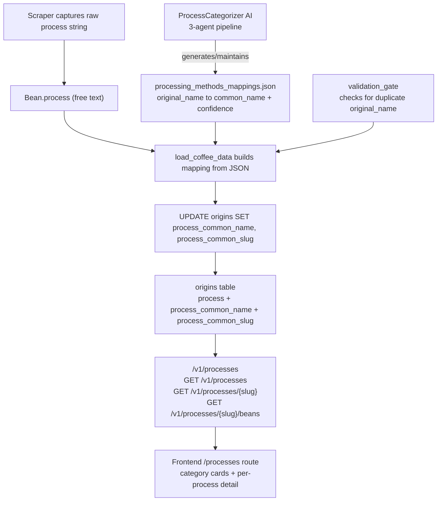

# Coffee Processing Methods

How a coffee is processed — what happens to the cherry between harvest and drying — is one of the single biggest determinants of cup flavour, alongside [origin geography](./origin-geography.md) and [tasting notes](./tasting-note-taxonomy.md). Kissaten treats processing method as a first-class attribute of each origin: the scraper captures whatever free-text label a roaster publishes, the `ProcessCategorizer` AI module normalises those labels into canonical names stored in `processing_methods_mappings.json`, the database loader applies that mapping to populate `process_common_name` and `process_common_slug` columns, and the `/v1/processes` API plus the frontend `/processes` route present the result as browsable category cards and per-process detail pages.

## Why processing matters for flavour

Coffee processing is the set of steps that transform a harvested coffee cherry into a dried green bean ready for roasting. The core decision is how much of the cherry's fruit material stays in contact with the bean during fermentation and drying, and under what conditions. This controls which microbes act on the bean, how much sugar and mucilage ferment, and which flavour compounds end up in the cup.

### The major methods

| Method | What happens | Flavour effect |
|---|---|---|
| **Washed** (a.k.a. wet) | Cherry skin and mucilage are removed before fermentation in water tanks, then the beans are washed and dried. | Clean, bright, acidic cup with well-defined flavours and high clarity. |
| **Natural** (a.k.a. dry) | Whole cherries are dried in the sun intact; the fruit dries onto the bean and is removed later. | Fruity, wine-like, heavier body and more natural sweetness; more fermentation-driven complexity. |
| **Honey** (a.k.a. pulped natural) | The skin is removed but some or all of the sticky mucilage (the "honey") is left on during drying. | A balance between washed cleanliness and natural sweetness; body and acidity sit between the two. |
| **Anaerobic** | Fermentation takes place in sealed, oxygen-free tanks (often with water or mosto). | Intense, often boozy or lactic flavours; increased complexity and sometimes funkier notes. |
| **Carbonic Maceration** | Cherries ferment in a CO₂-rich sealed environment (a technique borrowed from winemaking). | Controlled, intense fermentation flavours — wine-like, lactic, sometimes described as "boozy." |
| **Wet-Hulling** (Giling Basah) | Traditional Indonesian method: parchment is removed while the bean is still wet, then dried further. | Distinctly earthy, herbal, full-bodied profile characteristic of Sumatran and other Indonesian coffees. |
| **Co-Fermented / Infused** | External ingredients (fruits, spices, flowers) are added during fermentation. | Flavours derived from the added ingredients rather than terroir alone; transparency about this method matters for consumer expectations. |
| **Barrel-Aged** | Green or parchment coffee is rested in spirit or wine barrels after processing. | Boozy, oaky, vinous notes from the barrel's previous contents overlaying the base profile. |
| **Thermal Shock** | Rapid temperature changes (hot to cold water) are applied during fermentation. | Targeted flavour development through controlled microbial stress. |
| **Double Fermentation** | Two distinct fermentation stages (e.g. aerobic then anaerobic). | Layered complexity from sequential microbial activity. |
| **Decaf** | Caffeine is removed via Swiss Water, Ethyl Acetate (sugarcane), CO₂, or Mountain Water processes. | Intended to preserve the original flavour profile while removing caffeine; the method can subtly affect body and sweetness. |

The honey process has sub-levels — **White**, **Yellow**, **Red**, **Black** — that refer to how much mucilage is left on (more mucilage = darker honey = more fruitiness and body). These are preserved as distinct canonical names rather than collapsed into a single "Honey," because the flavour difference is material.

### Process and origin

Some origins are strongly associated with particular processes. Wet-hulling (Giling Basah) is traditional to Indonesia and produces the earthy, full-bodied profile associated with Sumatran coffees. Natural processing is historically common in Ethiopia, Yemen, and Brazil. The [origin geography](./origin-geography.md) page covers the country-to-region hierarchy; the `/v1/processes/{slug}` endpoint surfaces which countries and roasters are most associated with each process, making the process↔origin link explorable.

## The data model: free text, not an enum

The `Bean` Pydantic model (the per-origin element of `CoffeeBean.origins[]`) captures `process` as a free-text field:

```python
process: str | None = Field(
    None,
    max_length=100,
    description="Processing method. (e.g. Washed, Natural, Honey). Leave blank if not specified.",
)
```

This is deliberately **not** an enum. Roasters describe the same process in wildly inconsistent ways — `"Washed"`, `"Fully Washed"`, `"Washed, Raised Bed Dried"`, `"36 - 48 h wet fermentation, dried on raised beds"` are all the same method. An enum would either reject the vast majority of scraped values or force the scraper to guess a canonical name at scrape time, when the raw label is the only ground truth available. Instead, Kissaten stores the raw string as-is and defers canonicalisation to a dedicated, auditable, AI-assisted mapping step.

## The canonicalisation pipeline



*The flow from a scraped free-text process string to the browsable frontend category cards. The ProcessCategorizer AI maintains the mappings JSON; the validation gate guards loading; the DB loader applies the mapping to populate canonical columns; the API and frontend read those columns.*

### Step 1 — `processing_methods_mappings.json`

The canonical mapping file lives at `src/kissaten/database/processing_methods_mappings.json` and contains over a thousand entries, each with three fields:

- **`original_name`** — the raw process string as scraped from a roaster's page (e.g. `"36 - 48 h wet fermentation, dried on raised beds"`).
- **`common_name`** — the standardised canonical name (e.g. `"Washed, Raised Bed Dried"`).
- **`confidence`** — a 0–1 score (almost always `1.0` for reviewed entries).

The file is the single source of truth for process canonicalisation. Multiple `original_name` values legitimately map to the same `common_name` — that is the whole point of the merge step — but each `original_name` must appear at most once. Duplicate `original_name` entries (detected case-insensitively) would cause silent data loss in the dict-keyed loader, so they are treated as a bug.

### Step 2 — `ProcessCategorizer` AI module

The `ProcessCategorizer` class (`src/kissaten/ai/processing_method_categorizer.py`) uses a three-agent pipeline powered by `gemini-3.5-flash` to build and maintain the mappings file:

1. **Categorise agent** (`_create_agent`) — maps batches of raw process names to standardised common names. It is given the existing common names as context so it reuses them where appropriate, and is told to merge only names that refer to the exact same process. It validates that each returned `original_name` actually came from the input batch, discarding hallucinated mappings.

2. **Merge agent** (`_create_merge_agent`) — reviews existing common names and suggests additional merges where two names clearly refer to the same process (e.g. `"Fully Washed"` → `"Washed"`). It is conservative: when in doubt, it keeps names separate.

3. **Conflict-resolution agent** (`_create_conflict_resolution_agent`) — resolves cases where multiple `original_name` values map to the same `common_name`. It determines whether they truly represent the same process or should be kept separate, distinguishing genuine conflicts (different base method, different fermentation type, different decaf method) from benign variants (ordering differences, adverbs, time/duration info, punctuation).

The main entry point `categorize_all_methods()` orchestrates the full flow: load existing mappings → query the database for unique process names → filter out already-categorised ones → batch-categorise the remainder (50 per batch) → detect and AI-resolve conflicts → save the updated mappings → print statistics. The `--review-and-merge` CLI flag adds a second pass that reviews existing common names for additional merges.

### Step 3 — Validation gate

Before the database loader applies the mapping, `src/kissaten/ai/validation_gate.py` checks the file for duplicate `original_name` entries. The validator groups entries case-insensitively (matching how the loader's dict is keyed) and distinguishes:

- **Redundant** duplicates — entries that agree on `common_name` (e.g. `"Washed"` and `"WASHED"` both mapping to `"Washed"`). These are dead weight, not a bug; the loader handles them deterministically via last-writer-wins on the lowercased key.
- **Conflicting** duplicates — entries that disagree on `common_name` for the same lowercased key. These are a real bug because the dict-keyed loader would silently drop one mapping, and the SQL join (`LOWER() = LOWER()`) could resolve a scraped value to the wrong canonical on different runs.

The production loading paths (`load_coffee_data`, `refresh_canonical_data`) call the validator with `allow_redundant=True`, so they only block on genuine conflicts. The `SKIP_MAPPINGS_VALIDATION=1` environment variable bypasses validation entirely for emergency recovery. On failure, `MappingValidationError` is raised with a message directing the operator to run `kissaten validate-mappings`.

The `validate-mappings` CLI command (exposed as `uv run kissaten-pm validate-mappings`) uses the strict default (`allow_redundant=False`) so CI surfaces the full dirty state, including harmless redundant entries that the operator should clean up.

### Step 4 — Database loading

`_build_processing_mapping()` in `src/kissaten/api/db.py` loads the JSON file into a case-insensitive dict keyed by `lower(original_name)` with the `common_name` as the value. This mirrors the varietal SQL `LOWER()` join, so a scraped `process` value with arbitrary casing resolves to the same canonical.

During `load_coffee_data()`, each unique `process` value from the `origins` table is looked up:

```python
common_name = processing_mapping.get(process_value.lower())
```

If found, the `process_common_name` and `process_common_slug` columns are updated for all matching origins. If no mapping exists, the original process name is kept as the common name (and `process_common_slug` is set from the existing `process_slug` column), so unmapped processes are not lost — they simply appear under their own raw label until the categorizer is run again.

The `process_common_slug` column is populated via `normalize_process_name()`, which NFKD-normalises unicode, strips to ASCII, lowercases, and hyphenates — producing URL-friendly slugs like `anaerobic-natural` or `washed-raised-bed-dried`. An index (`idx_origins_process_common_slug`) supports slug-based lookups.

### Step 5 — `categorize_process`: broad category buckets

While the mapping file produces fine-grained canonical names (e.g. `"Anaerobic Natural"`, `"Carbonic Maceration Washed"`, `"Red Honey"`), the API and frontend also group processes into **eleven broad categories** via the `categorize_process()` function in `src/kissaten/api/main.py`. This is a keyword-based, priority-ordered matcher:

| Category key | Display name | Matched by |
|---|---|---|
| `infused_cofermented` | Infused & Co-Fermented | co-ferment, infused, cinnamon, passion fruit, strawberry, coconut, etc. |
| `barrel_aged` | Barrel Aged | "barrel" |
| `decaf` | Decaf Processes | decaf, ethyl acetate, swiss water, sugarcane |
| `anaerobic_carbonic` | Anaerobic & Carbonic | anaerobic, carbonic, maceration, anoxic |
| `advanced_technical` | Advanced Technical | thermal shock, koji, lactic, yeast, culturing, bacteria, nitrogen |
| `honey` | Honey Processes | "honey" |
| `washed` | Washed Processes | washed, lavado, washing |
| `natural` | Natural Processes | natural, dry, sun-dried, winey |
| `wet_hulled` | Wet Hulled | giling basah, wet hulled, wet-hulled |
| `experimental` | Experimental Processes | "experimental" |
| `other` | Other Processes | fallback |

The ordering matters: decaf is checked before base processes (because a "Washed, Sugarcane EA Decaf" should land in `decaf`, not `washed`), and co-fermented is checked first because additive/infusion labels are the most distinguishing. Generic fermentation terms (`ferment`, `inocul`, `bioreactor`, `mosto`) fall through to `advanced_technical`.

## API endpoints

### `GET /v1/processes`

Returns all processing methods grouped by the eleven categories. The endpoint is cached via `aiocache`'s `SimpleMemoryCache`. The SQL aggregates per `process_common_name`, counting distinct beans, roasters, and countries, and collecting the original raw process names (`STRING_AGG(DISTINCT o.process, ' ')`) alongside a per-country breakdown. Each process entry includes a `slug` (for the frontend detail route), `bean_count`, `roaster_count`, `country_count`, `countries` (a list of `{country_code, country_name, bean_count}`), and `category`. Category display names are title-cased from the slug key (e.g. `anaerobic_carbonic` → `"Anaerobic & Carbonic"`), except `other` which is hardcoded.

### `GET /v1/processes/{process_slug}`

Returns details for a single process, looked up by slug via `process_common_slug` (with a fallback to the older `process_slug` column). The response includes:

- **Statistics** — total beans, roasters, countries, and an average price (converted to the requested currency, default EUR).
- **Top countries** — up to six countries ranked by bean count, with full country names from the `country_codes` table.
- **Top roasters** — up to eight roasters ranked by bean count.
- **Common tasting notes** — the ten most frequent tasting notes across beans using this process, linking processing method to the [tasting note taxonomy](./tasting-note-taxonomy.md).
- **Original names** — the raw process strings that map to this canonical name, with per-name bean counts, showing the full set of roaster labels collapsed into one entry.

### `GET /v1/processes/{process_slug}/beans`

Returns a paginated, sortable list of `APISearchResult` beans for a given process, with optional currency conversion. Supports `page`, `per_page` (1–50), `sort_by`, and `sort_order` query parameters.

## Frontend

### `/processes` route

The listing route (`frontend/src/routes/(main)/processes/`) renders the eleven category groups as `ProcessCategoryCard` components. The `+page.ts` load function calls `api.getProcesses()` (hitting `/api/v1/processes`) and returns the categories plus metadata. The `+page.svelte` defines a fixed display order for the categories (`washed`, `natural`, `honey`, `anaerobic_carbonic`, `advanced_technical`, `infused_cofermented`, `barrel_aged`, `wet_hulled`, `decaf`, `experimental`, `other`) and provides a fuzzy search over process names within each category using `@nozbe/microfuzz`. Category icons, colours, and descriptions come from `frontend/src/lib/config/process-categories.ts`.

### `/processes/[slug]` route

The detail route loads process details and the bean list in parallel via `Promise.all([api.getProcessDetails(slug), api.getProcessBeans(slug, {...})])`. The page shows the process name, category badge, statistics (beans/roasters/countries/avg price), top countries and roasters as linkable `InsightCard` items, common tasting notes, and a paginated grid of `CoffeeBeanCard` components with `SortControls` and `PaginationControls`. When the beta feature is enabled, it also fetches podcast insights by searching the process name and its original names against the podcast index. The back-button and sort/pagination state update the URL via `goto` with `replaceState` and `noScroll`.

## Operational notes

- **Running the categorizer**: `uv run kissaten-pm categorize` (optionally `--review-and-merge` to run the merge pass after categorisation). This queries the DuckDB database for unique process names, sends uncategorised ones to the AI in batches of 50, resolves conflicts, and saves the updated mappings JSON.
- **Validating mappings**: `uv run kissaten-pm validate-mappings` checks the file for duplicate `original_name` entries and exits non-zero if any are found, making it suitable as a CI check. Use `--allow-redundant` to only fail on genuine conflicts.
- **Bypassing validation**: set `SKIP_MAPPINGS_VALIDATION=1` to skip the validation gate during `load_coffee_data` or `refresh_canonical_data` for emergency recovery.
- **Unmapped processes**: if a scraped process value has no entry in the mappings file, the database loader keeps the raw value as the common name, so it still appears in the API and frontend under its own label. Running the categorizer again will pick it up.
- **Redundant deduplication**: `dedupe_mappings_static` collapses pure case-variant duplicates (e.g. `"Washed"` and `"WASHED"` both mapping to `"Washed"`) deterministically, keeping the "nicest" representative — preferring entries with lowercase letters, then higher confidence, then names matching the canonical, then earliest position in the file.
