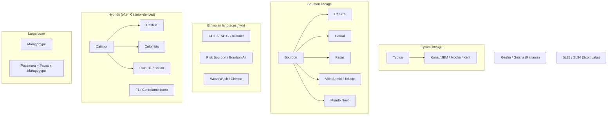
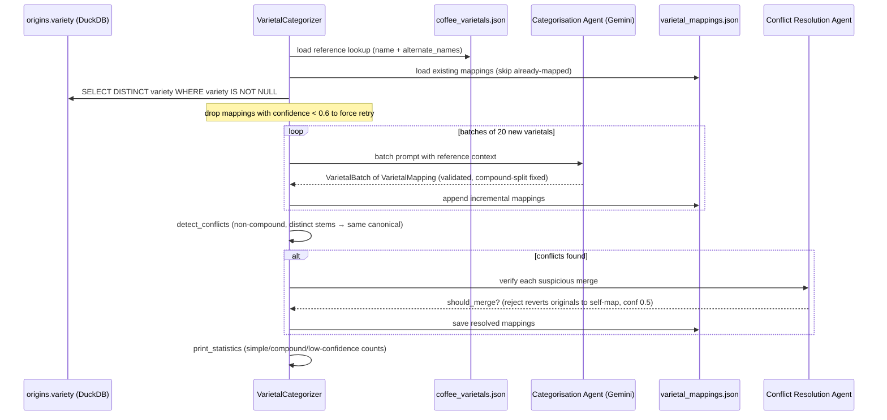

# Coffee Varietals

<!-- openwiki: broken internal link [../origin-geography.md] file "../origin-geography.md" does not exist. Fix the href or restore the target, then delete this comment. -->
<!-- openwiki: broken internal link [../tasting-note-taxonomy.md] file "../tasting-note-taxonomy.md" does not exist. Fix the href or restore the target, then delete this comment. -->
A **varietal** is the cultivated variety (cultivar) of the coffee plant that produced a given lot — typically *Coffea arabica*, but occasionally *C. canephora* (Robusta) or interspecific hybrids. In Kissaten the varietal is one of the most diagnostically rich origin attributes a roaster can publish: it implies a genetic lineage, a typical flavour tendency, and frequently a producing region (see [origin-geography](../origin-geography.md) and [tasting-note-taxonomy](../tasting-note-taxonomy.md)). This page covers the domain families Kissaten recognises and the full pipeline — schema field, World Coffee Research reference data, AI canonicalisation, API endpoints, and frontend route — that turns the messy free text roasters publish into a queryable, categorised catalogue.

## Why Kissaten stores free text and canonicalises later

Roasters do not speak in a controlled vocabulary. A single shop page may list `"Catuaí, Typica"`, `"Geisha"`, `"Bourbon Rosado"`, `"74110"`, or simply `"Mixed"`. Before any varietal can be aggregated, filtered, or charted it must be **normalised and, where necessary, split**:

- **Spelling / accent variants** — `Geisha` vs `Gesha`, `Catuaí` vs `Catuai`, `Cattura` vs `Caturra`.
- **Colour translations** — `Bourbon Rosado` → `Pink Bourbon`; `Bourbon Rojo` → `Red Bourbon`. Colour is preserved, never dropped, because `Red Bourbon` ≠ `Yellow Bourbon`.
- **Compound strings** — `"Caturra, Castillo & Bourbon"` is three distinct varieties joined by separators (`,` `&` `/` `+`). The model must detect the separator, split the string, and record `is_compound = true`.
- **Generic blends** — `Mixed`, `Varios`, `Variadades`, `Local Landraces` → canonical `Field Blend`, never split.

Kissaten therefore stores the roaster's verbatim text in the `variety` schema field and defers canonicalisation to the offline `VarietalCategorizer` (see [AI pipeline](../ai/ai-pipeline.md)). The canonical result is persisted in `varietal_mappings.json` and only later applied to the `origins` table as `variety_canonical` / `variety_canonical_slugs` columns, leaving the original text untouched.

## The `variety` schema field

The source of truth for a raw varietal is the `Bean` origin model. `variety` is a free-text, optional field capped at 100 characters:

```python
variety: str | None = Field(
    None, max_length=100,
    description="Coffee variety or varietal. (e.g. Catuai, Bourbon, etc.). "
    "Leave blank if there is no specific variety mentioned.",
)
```

It is carried on each element of `CoffeeBean.origins` (so a blend can declare a different varietal per component). The same field name (`variety`) is used by the brew-assistant API schema and re-appears verbatim in the DuckDB `origins` table. No validation is performed against a varietal list at scrape time — that is the categoriser's job.

## Arabica varietal families

Kissaten groups canonical varietals into nine display families. The grouping is produced at request time by the `categorize_varietal()` keyword matcher in the API and is mirrored by the frontend `varietalConfig`. The families, their canonical members, and their characteristic flavours are:

| Family (slug) | Representative varietals | Genetic lineage & flavour notes |
| --- | --- | --- |
| `typica` — Typica Family | Typica, Kona, Jamaica Blue Mountain, Mocha, Kent | The original Arabica lineage taken from Yemen to Java and onwards. Prized for exceptional cup quality and complex, clean flavours; low-yielding and disease-susceptible. |
| `bourbon` — Bourbon Family | Bourbon (Red/Yellow/Pink), Caturra, Catuai, Pacas, Villa Sarchi, Tekisic, Mundo Novo, Santos | A natural mutation of Typica from Île Bourbon (Réunion). Sweeter, more body, wine-like acidity. Caturra and Catuai are dwarf/compact Bourbon mutations that drive much of Latin American production. |
| `heirloom` — Heirloom Varieties | Ethiopian landraces (74110, 74112, Kurume, etc.), Pink Bourbon, Bourbon Ají, Wush Wush, Chiroso, "Heirloom", "Native", "Landrace", "Wild", "Forest" | Indigenous, wild, or pre-modern selections — especially the uncharacterised JARC selections and regional landraces of Ethiopia. Genetically diverse; floral, citrus, tea-like, highly origin-specific. Pink Bourbon is grouped here because it exhibits a wild/prehistoric genetic profile distinct from standard Bourbon colour sports. |
| `geisha` — Geisha / Gesha | Gesha (Gesha/Gecha), Geisha (Panama) | Ethiopian origin transplanted to Central America (notably Boquete, Panama). Floral, jasmine, bergamot, tea-like body, extraordinary complexity at high altitude. `Geisha` is normalised to `Gesha`. |
| `sl_varieties` — SL Varieties | SL28, SL34 (and other `SL\d+` Scott Labs selections) | Drought- and disease-tolerant selections bred by Scott Laboratories in Kenya. Bright, blackcurrant/wine-like acidity, full body. Numeric codes are distinct and never merged (SL28 ≠ SL34). |
| `hybrid` — Hybrid Varieties | Catimor, Castillo, Colombia, Tabi, Ruiru 11, Batian, Sidra, Marsellesa, Parainema, Centroamericano, Obata, Icatu, Starmaya, IHCAFE, F1 hybrids | Modern cultivars bred for rust/CBD resistance, productivity, or environmental adaptation. Catimor-derived lines (Castillo, Colombia, Ruiru 11) carry Robusta ancestry. Hybrids vs parents are never merged (e.g. Pacamara ≠ Pacas). |
| `large_bean` — Large Bean Varieties | Pacamara, Maragogype, Maragogipe, Elephant Bean | Typica/Bourbon mutations producing very large beans. Heavy body, lower acidity, distinctive physical size. Pacamara = Pacas × Maragogype. |
| `arabica_other` — Other Arabica | Red Catuai, Yellow Catuai (and other distinct Arabica not matching above) | Distinct Arabica varieties with specialised characteristics not falling into the main families. |
| `other` — Other Varieties | Anything unmatched (catch-all) | Rare discoveries, experimental crosses, and uncategorised local cultivars. |


The arabica varietal lineages Kissaten recognises, with the canonical members grouped into the nine API display families.

## Reference data: `coffee_varietals.json` (World Coffee Research)

Ground truth for canonical names comes from `src/kissaten/database/coffee_varietals.json`, a snapshot of the [World Coffee Research varieties database](https://varieties.worldcoffeeresearch.org/). Each entry has four fields:

- `name` — the canonical varietal name (e.g. `Caturra`, `Geisha (Panama)`, `Batian`).
- `description` — a short botany/agronomy summary (yield, altitude adaptation, disease resistance, cup potential).
- `link` — the canonical WCR variety page URL.
- `species` — the coffee species, currently always `arabica` for the included set.

The `VarietalCategorizer._load_varietals_reference()` loader builds a case-insensitive lookup keyed on both `name` and `name.lower()` (plus any `alternate_names`). This lookup is injected into the categorisation agent's system prompt so the LLM maps against a known, authoritative list rather than guessing. At load time `db.py` also copies the file into a DuckDB `coffee_varietals` table (`name`, `description`, `link`, `species`), which the `/v1/varietals/{slug}` detail endpoint joins to enrich a varietal page with WCR description and link.

## Canonicalisation: `VarietalCategorizer` and `varietal_mappings.json`

The offline `VarietalCategorizer` (`src/kissaten/ai/varietal_categorizer.py`) is a pydantic-ai CLI that turns the raw `variety` strings found in DuckDB into canonical mappings. It uses three Gemini agents — categorisation, merge review, and conflict resolution — all built with the `gemini-3.5-flash` model.

### Mapping record structure

Each mapping is a `VarietalMapping` persisted into `src/kissaten/database/varietal_mappings.json`:

| Field | Type | Meaning |
| --- | --- | --- |
| `original_name` | `str` | The verbatim roaster string (e.g. `"caturra rojo"`, `"Caturra, Castillo & Bourbon"`). |
| `canonical_names` | `list[str]` | Normalised canonical name(s). One entry for simple varietals; multiple for compounds. |
| `confidence` | `float` (0–1) | Categorisation confidence. ≥0.9 exact/standard fix; 0.8 compound split; <0.7 uncertain. |
| `is_compound` | `bool` | `true` when the original contained ≥2 distinct varieties. |
| `separator` | `str \| None` | The punctuation-only separator detected for compounds (e.g. `", "`, `" & "`, `"/"`). `null` for simple varietals. |

Example records:

```json
{ "original_name": "caturra rojo", "canonical_names": ["Red Caturra"], "confidence": 0.95, "is_compound": false, "separator": null }
{ "original_name": "Caturra, Castillo & Bourbon", "canonical_names": ["Caturra","Castillo","Bourbon"], "confidence": 0.98, "is_compound": true, "separator": ", &" }
```

### Compound-splitting logic

Compound detection is central to the model. The categorisation agent is prompted to look for separator punctuation (`,` `&` `/` `+`), split distinct known varieties, set `is_compound = true`, and record **only** the punctuation in `separator`. Two validators enforce correctness:

- `clean_separator` strips any alphanumeric characters from `separator`, so a stray `" & "` never leaks words into the field.
- `ensure_compound_split` (a `model_validator`) repairs the common LLM failure of returning the full compound string as a single `canonical_names` entry while still declaring a separator: if a separator is present and only one canonical name exists that itself contains the separator, it splits that entry into multiple names and flips `is_compound` to `true`.

Generic blend terms (`Mixed`, `Varios`, `Variadades`, `Local Landraces`) are deliberately **not** split — they map to the single canonical `Field Blend`.

### Categorisation pipeline

`categorize_all_varietals()` orchestrates the run:


The offline categorisation flow from raw DuckDB `variety` strings through Gemini agents to the persisted `varietal_mappings.json`, including conflict detection and resolution.

Key behaviours:

- **Incremental**: already-mapped `original_name`s are skipped; only new strings are sent to the LLM.
- **Retry on failure**: mappings with `confidence < 0.6` (typically 0.5 fallbacks from a failed batch) are dropped and re-processed on the next run.
- **Batch fallback**: if a batch errors, each input is written back as a self-mapping (`canonical_names = [self]`, `confidence = 0.5`) so processing continues and the entry is retried later.
- **Conflict detection** deliberately ignores compound mappings (a compound `"A, B"` legitimately maps to canonical `A` and `B` — that is containment, not synonymy) and ignores pure case/punctuation variants (`Typica` vs `TYPICA`) so only genuinely suspicious merges (`Red Bourbon` + `Pink Bourbon` → `Bourbon`) are flagged for the conflict-resolution agent.
- **Merge review** (`--review-and-merge`) is an optional second phase that consolidates canonical names for case, spelling, and format variations (e.g. `SL 28` / `SL-28` / `SL28`), never merging distinct colours, codes, or hybrids.

### Validation gate

Because `varietal_mappings.json` is a flat list and the DB loader keys it case-insensitively, a duplicate `original_name` (e.g. both `"GEISHA"` and `"Geisha"`) would silently collapse via last-writer-wins. `validate_varietal_mappings_file` (in `src/kissaten/ai/validation_gate.py`, delegating to `VarietalCategorizer.validate_mappings_static`) groups entries by `lower(original_name)` and distinguishes:

- **Conflicts** — same lookup key, *different* `canonical_names`. These raise `MappingValidationError` and block DB load (skippable only via `SKIP_MAPPINGS_VALIDATION=1`).
- **Redundant** — same lookup key, *identical* `canonical_names`. Dead weight; production loading passes `allow_redundant=True` to tolerate them, while the strict CLI `kissaten validate-mappings` surfaces them for cleanup.

The post-categorisation CLI also runs this gate automatically (unless `--skip-validation`) to catch duplicates the LLM or merge step introduced.

### Loading mappings into the database

`db.py` loads `varietal_mappings.json` at DB build time into the `varietal_mappings` DuckDB table (`original_name` primary key, `canonical_names VARCHAR[]`, `confidence`, `is_compound`, `separator`). It also builds an in-memory `original_name → canonical_names` dict that the origins ETL uses to populate `variety_canonical` and `variety_canonical_slugs`. The join is **case-insensitive**:

```sql
LEFT JOIN temp_varietal_mappings vm
  ON LOWER(COALESCE(t.origin.variety, '')) = LOWER(vm.original_name)
```

so `"GEISHA"` and `"Geisha"` resolve identically. When no mapping exists, `variety_canonical` falls back to the single-element array `[variety]`. `variety_canonical_slugs` is derived by applying `normalize_varietal_name` to each canonical name.

## URL slugs: `normalize_varietal_name`

`normalize_varietal_name` (in `db.py`, mirrored in `podcast_db.py`) produces stable, URL-friendly slugs for varietals: NFKD-decompose accents to ASCII, lowercase, strip non-alphanumeric/space/hyphen characters, and collapse runs of spaces/hyphens to a single hyphen. `Gesha` → `gesha`, `Catuaí` → `catuai`, `SL 28` → `sl-28`. These slugs populate `variety_canonical_slugs` and are the lookup key used by the `/v1/varietals/{varietal_slug}` endpoints.

## API endpoints

Three FastAPI endpoints expose varietals (see [backend-api](../api/backend-api.md)):

### `GET /v1/varietals`

Returns all canonical varietals grouped into the nine category buckets. A single CTE-based query aggregates per-canonical-varietal bean/roaster/country counts, country breakdowns, and the original (non-compound) names that map to each canonical. Each result is classified via `categorize_varietal()` and slugged via `normalize_varietal_name()`. Response shape per category:

```json
{
  "typica": {
    "name": "Typica Family",
    "total_beans": 123,
    "varietals": [
      { "name": "Typica", "slug": "typica", "bean_count": 50,
        "roaster_count": 8, "country_count": 4,
        "countries": [{"country_code":"CO","country_name":"Colombia","bean_count":20}],
        "category": "typica", "original_names": "Typica Kona ..." }
    ]
  }
}
```

The `original_names` aggregation excludes entries whose mapping is `is_compound = true` (a compound is containment, not synonymy, so it should not appear as an "alias" of a single canonical). The response is wrapped in `APIResponse` with `metadata.total_varietals` and is cached in memory.

### `GET /v1/varietals/{varietal_slug}`

Resolves a slug back to its canonical name by matching `variety_canonical_slugs`, then returns full detail: statistics (beans, roasters, countries, median price), top countries, top roasters, common tasting notes, common processing methods, original (non-compound) names, and WCR info (`description`, `link`, `species`) joined from the `coffee_varietals` table. Returns 404 if the slug matches no canonical varietal. Prices are convertible via `convert_to_currency` (default `EUR`).

### `GET /v1/varietals/{varietal_slug}/beans`

Paginated list of coffee beans whose `variety_canonical_slugs` contains the slug, supporting `page`, `per_page` (≤50), `sort_by`, `sort_order`, and `convert_to_currency`. Builds a temporary table of matching `bean_id`s and returns `APISearchResult` items with `varietal_name` / `varietal_slug` metadata.

## Frontend route

The varietals experience lives at `frontend/src/routes/(main)/varietals/`:

- **Index** (`+page.svelte`) loads `/v1/varietals` via `api.getVarietals(fetch)`, renders the nine categories in a fixed order (`typica`, `bourbon`, `heirloom`, `geisha`, `sl_varieties`, `hybrid`, `large_bean`, `arabica_other`, `other`), and provides a fuzzy search across varietal names. Each category is rendered by a `VarietalCategoryCard` component. An "Understanding Coffee Varietals" grid at the top uses the static `varietalConfig` (`frontend/src/lib/config/varietal-categories.ts`) for icon, colour, and family description.
- **Detail** (`[slug]/+page.svelte`) loads varietal details and paginated beans in parallel, shows statistics, top countries/roasters, common tasting notes and processing methods, WCR reference info, original name variants, and (when beta is enabled) podcast insights searched against the varietal name plus its original-name aliases.

The `varietalConfig` keeps the family names, icons, colours, and flavour descriptions in lock-step with the API `_VARIETAL_CATEGORY_NAMES` mapping so chip labels and category headings stay consistent between the uniqueness report, index page, and detail page.

## Operational notes

- **Environment**: categorisation requires `GEMINI_API_KEY`; optional `LOGFIRE_TOKEN` for monitoring. DB path defaults to `data/kissaten.duckdb` (overridable via `--database-path`).
- **CLI**: `kissaten categorize varietals [--review-and-merge] [--no-retry] [--skip-validation]` runs the categoriser and the post-run validation gate; `kissaten validate-mappings [--allow-redundant]` runs the strict duplicate-conflict check (suitable for CI, exits non-zero on any duplicate). The legacy module-level `python -m kissaten.ai.varietal_categorizer categorize` entrypoint remains.
- **Adding a varietal**: add it to `coffee_varietals.json` (name/description/link/species), then re-run categorisation — only previously-unmapped original names are re-processed, so existing mappings are preserved.
- **Reprocessing all**: back up and delete `varietal_mappings.json`, then re-run with `--review-and-merge`.
- **Low-confidence review**: `jq '.[] | select(.confidence < 0.7)'` against the mappings file surfaces entries needing manual correction.

## Related pages

- [AI pipeline](../ai/ai-pipeline.md) — where varietal categorisation sits in the broader AI module set.
- [Backend API](../api/backend-api.md) — `/v1/varietals` endpoints and response envelopes.
<!-- openwiki: broken internal link [../origin-geography.md] file "../origin-geography.md" does not exist. Fix the href or restore the target, then delete this comment. -->
- [Origin geography](../origin-geography.md) — varietals are region-associated (SL28 → Kenya, Gesha → Panama, Ethiopian landraces → Ethiopia).
<!-- openwiki: broken internal link [../tasting-note-taxonomy.md] file "../tasting-note-taxonomy.md" does not exist. Fix the href or restore the target, then delete this comment. -->
- [Tasting-note taxonomy](../tasting-note-taxonomy.md) — varietals influence flavour (Gesha → floral/jasmine; Bourbon → sweet/wine-like).
- [Data model](../data/data-model.md) — the `Bean.variety` field and `origins` table columns.
- [Name mappings](../data/name-mappings.md) — the shared original→canonical mapping pattern used by varietal and processing-method categorisers.
- [Roaster exploration](../design/roaster-exploration.md) — per-roaster varietal standouts surfaced via the uniqueness report.
