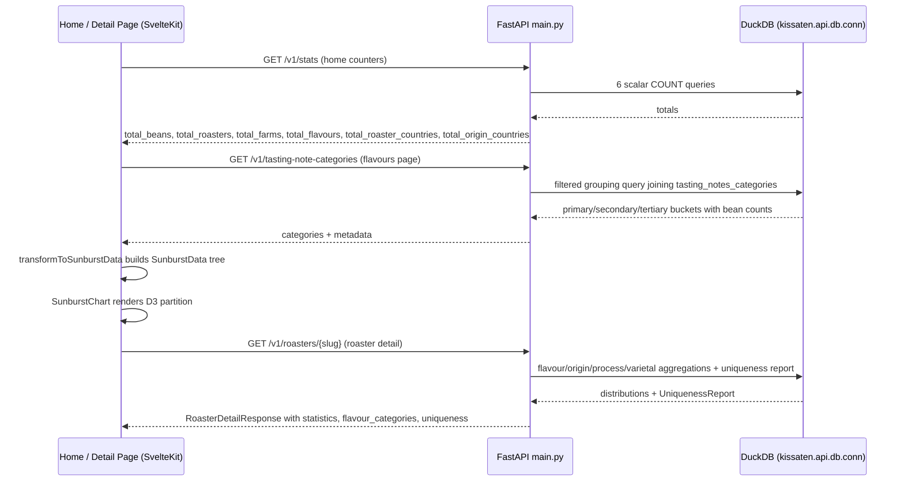

# Analytics & Insights Dashboards

Kissaten turns its scraped coffee-bean database into two complementary kinds of analytics: **database-wide totals** that communicate the scope of the catalogue, and **per-entity distributions** that reveal patterns about a single roaster, origin, process, or varietal. The former live on the home page as animated counters and on the flavours page as the `SunburstChart`; the latter are computed server-side as DuckDB aggregations and rendered on each detail page through `InsightCard`, donut/bar charts, and the roaster "What Makes Them Unique" uniqueness report.

The shared goal is to help users understand the database's scope and discover patterns — which origins are over-represented, which flavour categories dominate, where a roaster skews relative to the global average — and then funnel them into exploration (see [guided-discovery](../design/guided-discovery.md), [origin-exploration](../design/origin-exploration.md), and [roaster-exploration](../design/roaster-exploration.md)).

## Architecture overview

The analytics stack splits cleanly across a FastAPI backend and a SvelteKit frontend:

The diagram shows the three principal analytics flows: global stats, the tasting-note category distribution feeding the sunburst, and the per-roaster distribution plus uniqueness report. Origin, process, and varietal detail pages follow the same per-entity pattern with their own aggregations.

## The /v1/stats endpoint and home counters

### Endpoint

`GET /v1/stats` returns a single JSON object of six database-wide totals, cached for one hour via `aiocache`'s `SimpleMemoryCache`:

| Field | SQL source | Meaning |
|---|---|---|
| `total_beans` | `COUNT(DISTINCT clean_url_slug) FROM coffee_beans` | Unique bean listings (latest version per slug) |
| `total_roasters` | `COUNT(*) FROM roasters WHERE active = true` | Active roasters only |
| `total_farms` | `COUNT(DISTINCT COALESCE(farm_canonical, farm_normalized)) FROM origins` | Unique farms via the canonical/normalised mapping |
| `total_flavours` | `COUNT(DISTINCT tasting_note) FROM tasting_notes_categories` | Distinct flavour descriptors in the taxonomy |
| `total_roaster_countries` | `COUNT(DISTINCT location) FROM roasters WHERE active = true` | Countries roasters are based in |
| `total_origin_countries` | `COUNT(DISTINCT country) FROM origins` | Distinct origin countries |

The endpoint wraps the result in the standard `APIResponse[dict]` envelope and raises `HTTP 500` on any DuckDB error. Because it is `@cached(ttl=3600)`, the six queries run at most once per hour regardless of request volume.

### Home page consumption

The home `+page.ts` `load` function calls `api.getGlobalStats(fetch)` in parallel with four other data fetches (beans, roasters, processes, varietals) and maps the snake_case API fields into the camelCase `HomePageData.stats` shape. It seeds fallback totals (`5000`, `150`, `1000`, `200`, `20`, `45`) so the page can render before the fetch resolves.

The `+page.svelte` component does not display the numbers statically. It keeps six `$state` counters (`beansCounted`, `roastersCounted`, `farmsCounted`, `flavoursCounted`, `roasterCountriesCount`, `originCountriesCount`) initialised to zero. An `IntersectionObserver` watches the `#stats-section`; when it becomes visible (`threshold: 0.2`) the `animateCounters` function awaits the resolved `dataPromise`, reads the real `stats` totals, then runs a `requestAnimationFrame` loop over 2000 ms that floors each target by the elapsed progress. Each counter is rendered with `.toLocaleString()` plus a `+` suffix, alongside a decorative SVG (`StatsBean`, `StatsRoaster`, `StatsOrigins`, `StatsFlavours`) and a label. The four primary cards are **Coffee Beans**, **Roasters** (subtitled "Across {roasterCountriesCount}+ countries"), **Farms** (subtitled "From {originCountriesCount}+ origin countries"), and **Flavour Notes**. This gives visitors an immediate, animated sense of the catalogue's scale.

## SunburstChart: the flavour distribution visualisation

The `SunburstChart` is the primary analytics visualisation on the flavours page (`/flavours`). It is an interactive, zoomable D3 sunburst chart that renders the three-tier tasting-note taxonomy — primary → secondary → tertiary category, with individual notes as leaves — either across the entire database or scoped to whatever filters the user has applied on the page.

### Data pipeline

1. **Server.** `GET /v1/tasting-note-categories` groups all tasting notes by `primary_category`, `secondary_category`, and `tertiary_category` from the `tasting_notes_categories` table, joining against `coffee_beans` and applying the page's filter parameters (roaster, origin, process, variety, price, elevation, cupping score, etc.). It deduplicates beans per `clean_url_slug` (`rn = 1`) and returns `categories` (keyed by primary category) plus `metadata`.
2. **Client transform.** `transformToSunburstData` in `frontend/src/lib/utils/sunburstDataTransform.ts` builds a `SunburstData` tree with root name `"Tasting Notes"`. It flattens any `"General"` node by attaching its children directly to the parent, and for each tertiary category keeps the top ten tasting notes (by `bean_count`) as leaves while bucketing the remainder under an `"Other"` node flagged `isOther: true` (if more than one remains). D3 computes parent `value` sums from the leaf values.
3. **Render.** `SunburstChart.svelte` receives the `SunburstData`, sorts top-level children against `FLAVOUR_CATEGORY_ORDER` for consistent visual ordering, builds a `d3.hierarchy`, runs `d3.partition().size([2π, hierarchy.height + 1])`, and draws arcs with a dynamic colour scale keyed on canonical flavour-category hex colours (`getFlavourCategoryHexColor`).

### Interaction model

- **Zoom.** Clicking a non-leaf arc zooms the chart into that subtree: `currentZoomLevel` updates, the ring radius is rescaled (`computeRadiusScale` with stepped per-level weights from `currentZoomLevel >= 2`), and arc/label targets animate via a transition guarded by `isTransitioning`. Clicking the centre circle zooms back out.
- **Leaf selection.** On desktop, clicking a leaf fires the optional `onTastingNoteClick` callback (used by the flavours page to add the note to search filters) without zooming. On mobile (`window.innerWidth < 768`), leaf clicks instead show a tooltip with an "Add to Filters" button (invoking a global `window.addTastingNoteFilter` handler), so the gesture does not double as navigation.
- **Hover.** Hovering an arc highlights the ancestor chain (raising opacity to ≥ 0.95 and dimming siblings to ≤ 0.15) and shows a fixed-position tooltip with the breadcrumb path and a "Spotted N times" count. When flavour images are enabled (`flavourImagesEnabled`), hover also pre-fetches a representative painting image via `fetchAndSetFlavourImage`.
- **Touch.** On mobile the chart supports pinch-to-zoom (0.5×–3×), single-finger pan (clamped to ±200 px), and double-tap to reset all transforms; `applyCombinedTransform` composes pan + zoom around the pinch centre and `updateTextSize` rescales labels inversely to the zoom level so text stays legible.

The flavours page toggles between this sunburst view and a list view (`showSunburst`); the sunburst is rendered in a sticky side panel so users can browse the category cards while the chart stays in view.

## Per-entity statistics

Each detail page (roaster, origin country/region/farm, process, varietal) computes its own distributions server-side via DuckDB aggregations and renders them with a mix of dedicated charts and the reusable `InsightCard`.

### InsightCard

`InsightCard.svelte` is a generic, presentational component that renders a titled list of ranked items — each a `{ label, count, href, icon?, countryCode? }` — with a colour `variant` (`blue`, `orange`, `purple`, `green`) and singular/plural `unit`. Every item is an anchor linking into `/search?...` with the relevant filter pre-applied, so the card doubles as a discovery affordance: a user reading "Common Varietals" on an origin page can jump straight to a filtered search for that varietal within that origin. Optional `countryCode` renders a `circle-flags` flag icon via `iconify-icon`, and an optional per-item icon (e.g. a process glyph) prefixes the label. The card is reused across:

- **Origin pages** (`origins/[country_code]`, `[region_slug]`, `[farm_slug]`): "Common Varietals", "Processing Methods", and "Common Tasting Notes" cards, fed from `country.varietals`, `country.processing_methods`, and `country.common_tasting_notes`.
- **Process detail pages**: cards for top roasters, origins, and varietals associated with that process.
- **Varietal detail pages**: cards for top roasters, origins, and processes associated with that varietal.
- **Location layout** (`LocationLayout.svelte`): insight cards for the roasted-in location view.

### Roaster detail: distributions and the uniqueness report

The roaster detail endpoint (`GET /v1/roasters/{slug}`) returns a `RoasterDetailResponse` carrying several analytics artefacts computed in `main.py`:

- **`statistics`** (`RoasterStatistics`): `total_beans`, `available_beans`, `total_origins`, `total_varieties`, `avg_cupping_score`, `avg_price_usd`.
- **`flavour_categories`** (`FlavourCategoryCount[]`): primary tasting-note category distribution, computed only when the roaster has ≥ 3 categorised notes and excluding the non-flavour categories `Taste Basics`, `Mouthfeel`, and `Amplitude`. Each entry carries an absolute `count` and a `percentage` share. Rendered by `FlavourProfileDonut`.
- **`roast_distribution`** (`RoastLevelCount[]`): roast-level counts ordered Light → Dark, rendered by `RoastProfileBar`.
- **`top_origins`**, **`processing_methods`**, **`varietals`**, **`common_tasting_notes`**: top-N ranked aggregations from `origins` and `tasting_notes`.
- **`uniqueness`** (`UniquenessReport | None`): the roaster's stand-out dimensions.

#### The uniqueness report

`_compute_uniqueness_report` evaluates four dimensions — **flavour** (tasting-note primary category), **origin** (source country), **process** (processing category via `categorize_process`), and **varietal** (varietal family via `categorize_varietal`) — and, for each, finds the single category where this roaster most over-indexes versus the global average. Each candidate is gated by `min_sample_size >= 3`, `lift > 2.0` (percentage points above the global share), and `percentile > 60.0`. The flavour dimension additionally requires the standout category to clear the higher of 10% of the roaster's tasting notes or an absolute floor of 3 notes.

The single strongest insight (highest percentile, tie-broken by lift) is returned as `top`; the per-dimension winners (excluding the `top` dimension, so the headline and chip do not duplicate) form `by_dimension`. On the frontend, the roaster page renders `top` as a "What Makes Them Unique" headline and the `by_dimension` entries as chips, each linking to the relevant concept page (origin, process, varietal). When no dimension clears the thresholds, `uniqueness` is `None` and the section is omitted.

### Origin detail

Origin country, region, and farm pages receive a geography response (`CountryDetailResponse` / `RegionDetailResponse` / `FarmDetailResponse`) with `statistics` (bean/region/farm counts, average elevation, average price), an `elevation_distribution`, ranked `varietals`/`processing_methods`/`common_tasting_notes`, and (for regions/farms) top roasters. These power the quick-stats grid and the `InsightCard` triad. The concepts these visualise are documented in [tasting-note-taxonomy](../concepts/tasting-note-taxonomy.md), [processing-methods](../concepts/processing-methods.md), [varietals](../concepts/varietals.md), and [origin-geography](../concepts/origin-geography.md).

### Process and varietal detail

Process and varietal list endpoints aggregate across `origins` joined to `coffee_beans`, computing per-process/per-varietal `bean_count`, `roaster_count`, `country_count`, and a ranked `countries` list. The detail endpoints (e.g. `/v1/processes/{slug}`, `/v1/varietals/{slug}`) return `total_beans`, `total_roasters`, `total_countries`, `avg_price`, `common_tasting_notes`, and the ranked distributions rendered as `InsightCard`s. These connect to the [processing-methods](../concepts/processing-methods.md) and [varietals](../concepts/varietals.md) concept pages.

## ExpertInsightsSection

`ExpertInsightsSection.svelte` surfaces curated podcast episodes as a distinct kind of "insight". Unlike the data-driven `InsightCard`, it is gated behind the `userSettings.betaEnabled` flag and only renders when `podcasts.length > 0`. It receives an array of `GroupedPodcastHit` objects (grouped by podcast show) and renders up to three `PodcastInsightCard`s in a grid, with a "Show N more insights" toggle (`expanded` state) to reveal the rest. A `Lightbulb` icon and configurable title/subtitle frame the section, which is embedded on process, varietal, origin, and farm detail pages with the page's topic (e.g. `topic={varietal.name}`) so users can learn more about a concept from coffee experts.

## Design rationale

The analytics features exist to make the database's scope legible and to convert raw aggregation into discovery:

- **Scope communication.** The animated home counters give an immediate, honest sense of how large the catalogue is — beans, roasters, farms, flavours, and the geographic spread of both roasters and origins — which sets expectations before a user searches.
- **Pattern discovery.** The sunburst makes the tasting-note taxonomy's shape visible at a glance (which flavour categories dominate, how notes nest) and, because it respects the page filters, lets users see how a given roaster/origin/process/varietal subset skews the global distribution.
- **Per-entity context.** On detail pages, the distributions and `InsightCard`s answer "what is typical here?" (common varietals, processes, notes), while the roaster uniqueness report answers "what is atypical here?" — surfacing, for example, that a roaster skews toward Stone Fruit flavours or Ethiopian origins far more than the global average.
- **Exploration funnelling.** Every insight is also a link: counters and cards link into filtered searches; sunburst leaves add tasting-note filters; uniqueness chips link to concept pages. Analytics are not a dead-end dashboard but an entry point into the [guided-discovery](../design/guided-discovery.md) and [roaster-exploration](../design/roaster-exploration.md) flows.

## Related pages

- [backend-api](../api/backend-api.md) — FastAPI endpoints including `/v1/stats` and the detail endpoints.
- [frontend](../frontend/frontend.md) — SvelteKit routes and component architecture.
- [tasting-note-taxonomy](../concepts/tasting-note-taxonomy.md) — the primary/secondary/tertiary categories the sunburst visualises.
- [processing-methods](../concepts/processing-methods.md) — process categories surfaced in `InsightCard`s and uniqueness.
- [varietals](../concepts/varietals.md) — varietal families surfaced in `InsightCard`s and uniqueness.
- [origin-geography](../concepts/origin-geography.md) — origin countries/regions/farms and their statistics.
- [guided-discovery](../design/guided-discovery.md) — how analytics feed into discovery.
- [roaster-exploration](../design/roaster-exploration.md) — the roaster detail page hosting the uniqueness report.
