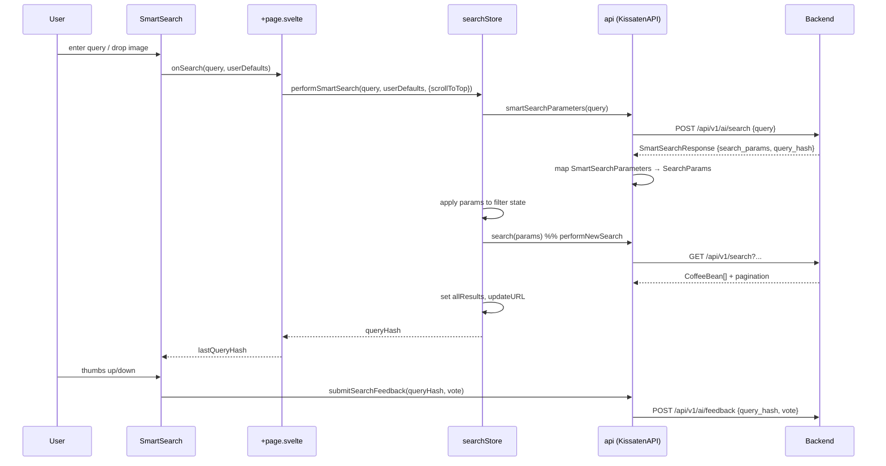

# Guided Discovery Experience

The guided discovery experience is the front door to Kissaten. Its central design premise is that **most users do not arrive knowing coffee terminology** — they cannot name a processing method, a varietal, or a tasting-note family, let alone compose a structured filter query. The home page therefore offers two parallel discovery paths that require no prior knowledge:

1. **AI-powered natural-language search** (`SmartSearch`) — "find me coffee beans that taste like a pina colada" — which translates plain English into structured `SearchParams`.
2. **Visual, browse-first entry points** — a flavour wheel, process category cards, and varietal category cards — that let users explore a domain by clicking rather than typing.

Both paths converge on the same faceted search infrastructure documented in [faceted-filtering.md](./faceted-filtering.md); the geographic discovery path is documented separately in [origin-exploration.md](./origin-exploration.md).

## Home page composition

The home page is `frontend/src/routes/(main)/+page.svelte`, with its data loaded by `frontend/src/routes/(main)/+page.ts`. The page is a long, scroll-driven narrative composed of several animated sections, observed by an `IntersectionObserver` that toggles per-section visibility flags (`section1Visible` … `faqVisible`, `statsVisible`) to trigger entrance animations. Smooth scrolling is provided by [Lenis](https://github.com/darkroomengineering/lenis), initialised in `onMount` and driven by a `requestAnimationFrame` loop; the Lenis instance is also passed down to the `CoffeeJourney` component so its scroll-driven animation stays in sync with the page.

The sections, in order, are:

1. **Hero** — logo, tagline ("Your Coffee Journey Starts Here"), the `SmartSearch` component, and two call-to-action buttons: *Explore the Journey* (smooth-scrolls to the stats section) and *Browse All Beans* (links to `/search`). An *Advanced Search* link points at `/search#advanced-search`.
2. **Stats** — animated counters for beans, roasters, farms, flavour notes, roaster countries, and origin countries.
3. **CoffeeJourney** — the scroll-pinned animated map (see [below](#coffeejourney-component)).
4. **Explore every dimension** — three descriptive feature cards (*Trace Your Beans*, *Processing Methods*, *Varietal Explorer*) that frame the domain entry points.
5. **Call to action** — *Start Your Journey* → `/search`, *Explore Origins* → `/origins`.
6. **FAQ** — an accordion answering common questions (the meaning of "Kissaten", pricing model, AI sustainability).
7. **Attributions**.

### Parallel home-page data loading

`+page.ts` returns a single `dataPromise` rather than blocking the route. `fetchHomePageData` issues five API calls in parallel via `Promise.all`:

- `api.search({ per_page: 4, sort_by: 'date_added', sort_order: 'random', convert_to_currency })` — four random beans for the carousel.
- `api.getRoasters()` — roasters, filtered to those with `current_beans_count > 0`, shuffled, sliced to four.
- `api.getProcesses()` / `api.getVarietals()` — flattened across categories, shuffled, sliced to four each.
- `api.getGlobalStats()` → `GET /api/v1/stats` — the real counter targets.

The combined bean/roaster/process/varietal items are merged into a `carouselItems` array (typed `bean | roaster | process | varietal`) and shuffled. If any fetch fails, the stats fall back to placeholder targets (`5000 / 150 / 1000 / 200 / 20 / 45`) so the counters always animate.

### Animated stats counters

The stats section animates six counters (`beansCounted`, `roastersCounted`, `farmsCounted`, `flavoursCounted`, `roasterCountriesCount`, `originCountriesCount`) from zero to their real targets. Animation is triggered when the `#stats-section` enters the viewport (intersection threshold `0.2`): `animateCounters` awaits `dataPromise`, reads `homeData.stats`, then runs a `requestAnimationFrame` loop over a 2000 ms duration, flooring each target by progress. Each counter card also has a staggered CSS `transition-delay` (0/100/200/300 ms) for a cascading reveal.

## SmartSearch flow

`SmartSearch` (`frontend/src/lib/components/search/SmartSearch.svelte`) is the AI entry point. It accepts either **natural-language text** or an **image** (drag-and-drop or camera capture), and is parameterised by callbacks so it can be reused on both the home page and the search results page.

### End-to-end control flow

The numbered responsibilities are:

1. **Input.** `SmartSearch` holds a bindable `value` and an optional image `preview`. On submit (`handleSearch`) it calls `onSearch(value, userDefaults)` for text, or `onImageSearch(file, userDefaults)` for an image. A rotating set of placeholder prompts (e.g. "Panama Geisha coffees with funky flavours…") cycles every 3 seconds to suggest the kinds of queries the AI can parse.
2. **AI parameterisation.** The home page's `performSmartSearch` / `performImageSearch` delegate to `searchStore.performSmartSearch`, which calls `api.smartSearchParameters(query)`. This issues `POST /api/v1/ai/search` with a JSON body `{ query }` (image search uses `POST /api/v1/ai/imagesearch` with `multipart/form-data` field `file`).
3. **Parameter mapping.** The backend returns a `SmartSearchResponse` whose `data.search_params` is a `SmartSearchParameters` object (fields like `search_text`, `tasting_notes_search`, `roaster`, `roaster_location`, `origin`, `process`, `variety`, `min_elevation`, `is_decaf`, `sort_by`, plus AI metadata `confidence` and `reasoning`). `api.smartSearchParameters` converts this into the flat `SearchParams` shape consumed by the standard search endpoint — e.g. `search_text → query`, `tasting_notes_search → tasting_notes_query`.
4. **State application.** `searchStore.performSmartSearch` writes each mapped field into the store's filter state (`roasterFilter`, `originFilter`, `processFilter`, `varietyFilter`, price/weight/elevation bounds, etc.), normalising scalar/array fields with `new Set(...)`. It also reconciles the user's default roaster locations: if the active location filter already equals the user default *and* the AI suggested no location, the default is preserved; otherwise the AI's suggestion overrides.
5. **Execution.** `performNewSearch()` builds `SearchParams` from the store state and calls `api.search(params)` → `GET /api/v1/search?...`, storing the returned beans in `allResults` and updating the URL.
6. **Feedback.** `api.smartSearchParameters` returns a `queryHash`. `SmartSearch` captures it (`lastQueryHash`) and, while the filter fingerprint (`filterKey`) remains unchanged, shows a thumbs-up / thumbs-down row. A vote calls `api.submitSearchFeedback(queryHash, vote)` → `POST /api/v1/ai/feedback` with `{ query_hash, vote }`.

### Rate-limit fallback

If the AI endpoint returns `429`, `api.smartSearchParameters` returns a `rateLimited` result carrying `rateLimitResetAt`. The store then **falls back to standard keyword search**: it sets `ftsQuery = query`, `sortBy = "relevance"`, marks `smartSearchRateLimited = true`, and still runs `performNewSearch()` so the user gets results. `SmartSearch` renders an amber "Smart search is overloaded — falling back to standard keyword search" banner (with the approximate hours-to-restore and a link to the advanced filter UI) whenever `rateLimited` is true, and disables the submit button.

### Image search

`SmartSearch` wraps its text input in a `Dropzone` accepting `image/jpeg`, `image/png`, `image/webp`, and `image/avif`. Selected images are resized to 1500×1500 (`resizeImage`) before being sent, and the text input is cleared while an image preview is present. The image path uses `api.smartImageSearchParameters` → `POST /api/v1/ai/imagesearch`, otherwise following the same mapping → store → `performNewSearch` pipeline and the same rate-limit handling.

## CoffeeJourney component

`CoffeeJourney` (`frontend/src/lib/components/home/CoffeeJourney.svelte`, ~71 KB — the largest frontend component) is an animated, scroll-pinned "treasure map" that visualises the coffee supply chain. Its role in guided discovery is narrative: it teaches the user the stages coffee passes through — **Cultivation → Plantation → Harvest → Processing → Roasting → Brewing** — so that the domain entry points (processes, varietals, origins) become legible.

### Structure

- The outer wrapper `#section-journey-wrapper` is `300vh` tall; the inner `#section-journey` is `sticky` and full-height, so the map stays pinned while the user scrolls through three screen-heights of progress.
- An SVG `#journey-path` is a single dynamically-generated S-shaped dotted bezier path. Its `d` attribute is derived (`$derived.by`) from the measured `mapWidth`/`mapHeight` (bound via `clientWidth`/`clientHeight`), with separate mobile/desktop padding and squiggle amplitudes, so the path never distorts on resize.
- Six **stations** are absolutely positioned at percentage coordinates along the path, each with an icon and label: Cultivation (Dna), Plantation (Leaf), Harvest (Sparkles), Processing (Droplets), Roasting (Flame), Brewing (Coffee). Stations fade/translate in with staggered delays when `journeyVisible` becomes true.
- Four **vehicles** — a farmer, a jeep, a ship, and a cyclist (with a final emoji) — travel along the path. Their positions are updated by `updateVehiclePositions(progress)`, which uses `SVGPathElement.getPointAtLength` against an approximated per-leg length split (legs end at progress 0.2 / 0.4 / 0.6 / 0.8 / 1.0). Each vehicle is opacity-toggled based on its active leg, giving the impression of hand-off between stages.

### Scroll binding

`handleJourneyScroll` computes `journeyAnimationProgress` from the wrapper's `getBoundingClientRect` relative to the viewport height, clamped to `[0, 1]`. The scroll handler is attached to the Lenis instance when present (passed in as a prop from the home page), falling back to a native `scroll` listener. An `IntersectionObserver` (threshold `0.1`) sets `journeyVisible` when the wrapper enters view, gating both the entrance animations and the scroll handler. A `resize` handler re-runs `updateVehiclePositions` so vehicle placement tracks the mobile/desktop path switch.

## Explore-by-domain entry points

The home page's "Explore every dimension" section frames three discovery domains, each backed by a dedicated route and a domain concept page. These routes are also surfaced as top-level navigation items (`Beans`, `Origins`, `Varietals`, `Processes`, `Roasters`, `Flavours`) in the main layout.

### Flavours → `/flavours`

The flavours route (`frontend/src/routes/(main)/flavours/+page.svelte`) is the visual flavour-wheel entry point. It renders a `SunburstChart` (built from `transformToSunburstData` + d3) alongside `TastingNoteCategoryCard`s, backed by `GET /api/v1/tasting-note-categories` (loaded in `+page.ts`, which forwards the full set of faceted filter parameters from the URL). Flavour images can be toggled on/off (disabled on mobile by default). This route is the discoverability surface for the tasting-note taxonomy documented in [tasting-note-taxonomy.md](../concepts/tasting-note-taxonomy.md).

### Processes → `/processes`

The processes route (`frontend/src/routes/(main)/processes/+page.svelte`) renders `ProcessCategoryCard`s in a fixed category order — `washed`, `natural`, `honey`, `anaerobic_carbonic`, `advanced_technical`, `infused_cofermented`, `barrel_aged`, `wet_hulled`, `decaf`, `experimental`, `other` — and provides a client-side fuzzy search (`@nozbe/microfuzz`) over process original names. Each process links through to a `[slug]` detail page, which in turn links to `/search?process=...`. The domain concepts are documented in [processing-methods.md](../concepts/processing-methods.md).

### Varietals → `/varietals`

The varietals route (`frontend/src/routes/(main)/varietals/+page.svelte`) mirrors the processes structure with `VarietalCategoryCard`s in category order — `typica`, `bourbon`, `heirloom`, `geisha`, `sl_varieties`, `hybrid`, `large_bean`, `arabica_other`, `other` — and the same `@nozbe/microfuzz` client-side filtering (with punctuation/space stripping to improve matching). Varietal detail pages link to `/search?variety=...` and, where available, to World Coffee Research info links. The domain concepts are documented in [varietals.md](../concepts/varietals.md).

## Design rationale

The two-path design directly addresses the knowledge asymmetry in specialty coffee. A user who can already articulate "Colombian pink bourbon, washed, citrus, above 1800 m" can use the advanced faceted filters directly. A user who cannot is served by:

- **SmartSearch**, which lets them describe a desired experience in natural language (or photograph a bag) and have an LLM map that description onto the same structured `SearchParams` the faceted search uses. The AI's `confidence` and `reasoning` fields are returned alongside the parameters, and the thumbs-up/down feedback loop (`/api/v1/ai/feedback`) lets the system learn from poor mappings.
- **Visual entry points**, which present the taxonomy itself as the interface: the flavour wheel shows the whole tasting-note universe at a glance; process and varietal category cards group unfamiliar terms into approachable buckets. Fuzzy client-side search within each route lets users find "Geisha" without knowing its category.

Crucially, both paths terminate in the same `GET /api/v1/search` endpoint and the same `searchStore` state, so the faceted filtering UI on `/search` can refine any result set — whether it originated from a natural-language query, a flavour-wheel click, or a direct URL. This convergence is what makes the discovery experience coherent rather than fragmented.
