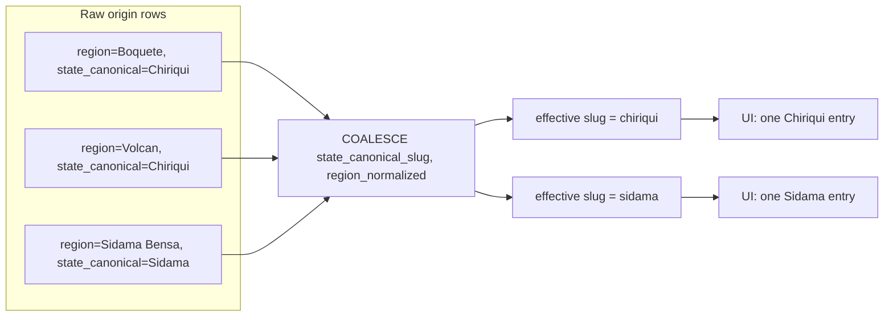

# Origin Exploration & Interactive Map

The origin exploration flow lets users discover coffee by **terroir** — the
environmental factors (altitude, latitude, soil, climate) that shape a bean's
flavour — by drilling from country down to region and finally to farm. It is a
core concept in specialty coffee, and Kissaten models it as a strict three-level
geographic hierarchy exposed through both the `/v1/origins` API and the
`/origins` SvelteKit routes.

This page documents the design of that flow: the drill-down hierarchy, the
canonical-region-slug grouping invariant that keeps the hierarchy consistent,
the statistics surfaced at each level, and the frontend components that render
navigation context and elevation visualisations. The underlying data model and
normalisation rules are described in [origin-geography.md](../concepts/origin-geography.md);
the statistics themselves are shared with the analytics described in
[analytics-insights.md](./analytics-insights.md); the per-origin varietal and
processing-method distributions link out to [varietals.md](../concepts/varietals.md)
and [processing-methods.md](../concepts/processing-methods.md).

## Design rationale: exploration by terroir

Specialty coffee buyers reason about origin at multiple granularities. A user
may start broad ("what does Ethiopia offer?"), narrow to a growing region
("Yirgacheffe"), and finally to a farm ("Konga Washing Station"), because each
step adds terroir detail — elevation, varietal mix, processing tradition — that
narrows the flavour expectation. The exploration flow mirrors this mental model:

- It is **hierarchical and reversible**: breadcrumbs let a user step back up
  exactly the path they descended.
- It is **aggregated at every level**: each page surfaces bean counts, farm
  counts, elevation stats, top roasters, top tasting notes, and
  process/varietal distributions, so a user can compare terroirs without leaving
  the page.
- It is **deduplicated by canonical geography**: raw region strings that refer to
  the same real-world state are merged into one entry (see below), so a user
  never sees "Boquete" and "Volcán" as separate countries-within-a-country when
  they are both in Chiriquí, Panamá.

The result is an experience that favours comparison and serendipity over raw
list browsing — closer to an interactive atlas than a search results page.

## The three-level drill-down

The hierarchy is exposed as nested routes and nested API endpoints. Each level
materialises a temporary table of the relevant `bean_id` set and then runs
aggregation queries against it, so the slow scan happens once per request and
all statistics come from the materialised set.

<!-- openwiki: mermaid parse failed and this diagram was converted to a text fence so it does not break rendering. Fix the diagram source and restore the mermaid fence. Parser error: Heuristic: an unescaped angle bracket inside a label breaks rendering; rephrase the label. -->
```text
flowchart TD
    L0["/origins — all countries<br/>GET /v1/origins"]
    L1["/origins/{country_code} — regions<br/>GET /v1/origins/{cc}<br/>GET /v1/origins/{cc}/regions"]
    L2["/origins/{country_code}/{region_slug} — farms<br/>GET /v1/origins/{cc}/{slug}"]
    L3["/origins/{country_code}/{region_slug}/{farm_slug} — beans<br/>GET /v1/origins/{cc}/{slug}/{farm}"]
    L0 --> L1 --> L2 --> L3
```

The drill-down levels and the statistics surfaced at each.

### Level 1 — `/origins` (all countries)

The top-level route lists every country that has beans, mapped from the
`/v1/origins` endpoint. Each entry carries a `country_code` (ISO 3166-1
alpha-2), `country_name`, `bean_count`, and `roaster_count`. The frontend
presents these as `OriginResultCard`s via `UniversalOriginSearch`, with the
country list as the default results and a free-text search that delegates to
`/v1/search/origins`.

### Level 2 — `/origins/{country_code}` (regions)

The country page loads country detail (`/v1/origins/{cc}`) and the regions list
(`/v1/origins/{cc}/regions`) in parallel from `+page.ts`. It renders a header
with the country flag, a quick-stats grid (total beans, regions, farms, average
elevation), three `InsightCard`s for varietals, processing methods, and tasting
notes, an `ElevationMountainChart` of the country's regions, and the regions
themselves via `UniversalOriginSearch`. Each region becomes an
`OriginResultCard` whose `region_slug` is computed client-side with
`normalizeRegionName`.

The country-detail response (`CountryDetailResponse`) carries:

- `statistics`: `total_beans`, `total_roasters`, `total_regions`,
  `total_farms`, `avg_elevation`, `avg_price_usd`
- `top_roasters`, `top_regions` (a `RegionSummary` list)
- `common_tasting_notes`, `varietals`, `processing_methods`
- `elevation_distribution` (`min`/`max`/`avg`)

### Level 3 — `/origins/{country_code}/{region_slug}` (farms)

The region page loads `RegionDetailResponse` from
`/v1/origins/{cc}/{slug}`. It shows the region header (with an "Unverified
Region" warning when `is_geocoded` is false), a stats grid (beans, roasters,
known farms, average elevation), the same three `InsightCard`s, a farm-level
`ElevationMountainChart`, and the farm list via `UniversalOriginSearch` scoped
to the region. Farms are surfaced as `OriginResultCard`s with `farm_slug`
derived from `normalizeFarmName`.

`RegionDetailResponse` carries `statistics` (`total_beans`, `total_roasters`,
`total_farms`, `avg_elevation`, `avg_price_usd`), `top_farms` (a `FarmSummary`
list that always includes a synthetic "Unknown Farm" bucket for beans without a
named farm), `top_roasters`, `common_tasting_notes`, `varietals`,
`processing_methods`, `elevation_range`, and `is_geocoded`.

### Level 4 — `/origins/{country_code}/{region_slug}/{farm_slug}` (beans)

The farm page loads `FarmDetailResponse` from
`/v1/origins/{cc}/{slug}/{farm}`. It renders the farm header (with coordinates
and elevation badges), an `ElevationMountainChart` of the farm's beans, the
three `InsightCard`s, and a list of `CoffeeBeanCard`s for the actual beans.
`FarmDetailResponse` carries `farm_name`, `producer_name`, `producers`,
`region_name`/`country_code`/`country_name`, `latitude`/`longitude`,
`elevation_min`/`elevation_max`, `beans` (full `APISearchResult` objects with
nested origins), and the same varietal/process/note distributions.

## The canonical region slug grouping invariant

This is the most critical invariant in the origin endpoints, and it exists
purely for UX correctness. When origins are geocoded, a raw `region` string
(e.g. "Boquete", "Volcán") may differ from the canonical `state_canonical`
(e.g. "Chiriquí"). Multiple raw regions map to the same canonical state. Without
a shared grouping expression, a user would see "Boquete" and "Volcán" as separate
region entries even though they are the same real-world state — defeating the
purpose of terroir-based exploration.

The invariant is enforced by using **one expression** for region identity across
the regions-list `GROUP BY`, the region-detail `WHERE`, and the farm-detail
`WHERE`:

```sql
COALESCE(o.state_canonical_slug, o.region_normalized)
```

This computes the "effective slug" — the canonical slug when geocoded, falling
back to the raw region slug otherwise. The regions-list groups by it (merging
all raw variants into a single entry per canonical state), and the detail
endpoints filter by it. Display names prefer the canonical state name via
`MODE(o.state_canonical) FILTER (...)`, falling back to `MODE(o.region)`.



### Why `OR`-based filters leak data

A previous implementation used
`WHERE normalize_region_name(state_canonical) = ? OR region_normalized = ?`.
This caused "slug leaks": a row whose raw slug matched the query but whose
canonical slug belonged to a different group would be incorrectly included. For
example, querying `sidama-bensa` matched rows with
`region='Sidama Bensa'` (raw slug `sidama-bensa`) even though their
`state_canonical='Sidama'` places them in the `sidama` canonical group —
returning 55 beans instead of the correct 7. The `COALESCE`-based filter
evaluates each row's effective slug once and only matches rows that truly belong
to the requested group.

### Cross-region leak prevention in region detail

Region-detail runs six sub-queries (stats, known farms, unknown farms,
varietals, processes, elevation) that each join `origins o ON t.bean_id = o.bean_id`.
Because a bean can have origins in multiple regions, **every** one of those joins
must also include the region filter (`AND {region_filter_sql}` with params).
Missing the filter on even one sub-query leaks data from other regions into the
response. All six joins carry the filter.

### Unknown-region handling

Beans with a null or empty `region` are aggregated into a single "Unknown
Region" entry (slug `unknown-region`) in the regions list, and region-detail
uses a special branch (`o.region IS NULL OR o.region = ''`) for that slug.
Farm-detail has the analogous `unknown-farm` slug for beans without a named
farm, and the farm filter uses `(normalize_farm_name(o.farm_canonical) = ? OR o.farm_normalized = ?)`.

### Consistency invariants enforced by tests

The test suite pins the cross-level consistency that makes the drill-down
trustworthy:

- Country list `bean_count`/`roaster_count` equal country-detail
  `total_beans`/`total_roasters`.
- Region list `bean_count`/`farm_count` equal region-detail
  `total_beans`/`total_farms`.
- No duplicate region names in the regions list.
- `normalize_region_name(region_name)` round-trips to the same `region_name` in
  detail.
- No region's `bean_count` exceeds its country's `total_beans`.
- Length of `top_farms` (excluding "Unknown Farm") equals `total_farms`.
- Sum of farm `bean_count` values ≥ region `total_beans`.
- Raw slugs subsumed into a canonical group do not appear as independent
  entries, and querying a subsumed raw slug does not return the canonical
  group's data.

## Statistics surfaced at each level

Every level surfaces the same families of statistics, computed from the
materialised bean set, so users can compare terroirs without changing pages.

| Statistic family | Source | Notes |
|---|---|---|
| Bean / roaster / farm / region counts | `statistics` on each response | Farm counts use `COUNT(DISTINCT COALESCE(farm_canonical, farm_normalized)) FILTER (WHERE farm IS NOT NULL AND farm != '')` so the synthetic "Unknown Farm" bucket is excluded from the count. |
| Elevation | `elevation_distribution` (country), `elevation_range` (region), `elevation_min`/`max` (farm) | `ElevationMountainChart` visualises these; see below. |
| Top roasters | `top_roasters` | `TopRoaster` (name + bean_count). |
| Tasting notes | `common_tasting_notes` | `TopNote` (note + frequency); links to `/search?tasting_notes_query="..."&origin=...`. |
| Varietals | `varietals` | `TopVariety` using `variety_canonical`; links to `/varietals/{slug}` via search. |
| Processing methods | `processing_methods` | `TopProcess` using `COALESCE(NULLIF(process_common_name, ''), process)`; links to `/processes/{slug}` via search. |

The varietal and processing distributions are canonicalised (see
[varietals.md](../concepts/varietals.md) and
[processing-methods.md](../concepts/processing-methods.md)): the API prefers
`variety_canonical` over raw `variety`, and `process_common_name` over raw
`process`, so the per-origin distributions reflect the canonical taxonomy rather
than roaster-supplied free text.

## Frontend components

### `GeographyBreadcrumb`

`GeographyBreadcrumb.svelte` renders the reversible path
Origins → Country → Region → Farm, computing `regionSlug` and `farmSlug` from
the display names via `normalizeRegionName` / `normalizeFarmName`. Because the
slugs are derived client-side from the *display* name (which is the canonical
state name when geocoded), the breadcrumb links match the `COALESCE`-based
effective slugs the backend filters on — provided the display name and the
backend's `MODE()`-chosen name agree, which the consistency invariants
guarantee.

### `ElevationMountainChart`

`ElevationMountainChart.svelte` is a D3 visualisation that plots elevation
points on a stylised mountain silhouette. It adapts to its context:

- **Regions mode** (country page): each `RegionSummary` becomes a point at its
  `median_elevation`, linking to `/origins/{cc}/{regionSlug}`.
- **Farms mode** (region page): each `FarmSummary` becomes a point at its
  `avg_elevation`, linking to the farm route.
- **Beans mode** (farm page): each bean becomes a point at the average of its
  per-origin elevation, falling back to farm-level `farmElevationMin`/`Max`.

The y-axis is fixed at 0–3000 m so charts are comparable across regions and
farms. Points are placed at the centre of the mountain's width at their
elevation, then a `d3.forceCollide` simulation jostles them horizontally to
avoid overlap while a custom `fixY` force restores each node toward its target
elevation each tick. Warehouse icons are used for region/farm points; plant
icons for bean points. Each point is clickable (navigating to its `url`) and
shows a tooltip with name, secondary label, and elevation.

### `RegionCard` and `FarmCard`

`RegionCard.svelte` and `FarmCard.svelte` are card components for region and
farm summaries. `RegionCard` shows bean count, farm count, and an "Explore
Region" button linking to `/origins/{cc}/{regionSlug}`; it appends "(?)" to the
display name when `is_geocoded` is false, surfacing the unverified-region state
at the card level. `FarmCard` shows producer name, bean count, and average
elevation, linking to `/origins/{cc}/{regionSlug}/{farmSlug}`. Both derive their
slugs from the display name with the shared normalisers, keeping URL generation
consistent with the breadcrumb and chart.

### `OriginResultCard`

`OriginResultCard.svelte` is the unified result card used by
`UniversalOriginSearch` across all three list levels. It accepts an
`OriginSearchResult` (type `country` | `region` | `farm`) and renders a
type-coloured header with the country flag, a type badge for non-country
results, the result name, and a parent-context subtitle (country code, country
name, or `region, country`). It offers two actions: a "Learn" button that links
to the entity's drill-down route (computed from `country_code`, `region_slug`,
and `farm_slug`), and an "Explore N Beans" button that links to `/search` with
`origin`/`region`/`farm` query parameters pre-filled.

### `UniversalOriginSearch`

`UniversalOriginSearch.svelte` is the shared search-and-list component used on
all three list pages. It takes `defaultResults` (the level's entities mapped to
`OriginSearchResult`), an optional `countryCode`/`regionSlug` scope, and a
bindable `searchQuery`. When the query is empty it shows the default results;
when non-empty it debounces 300 ms and calls `searchOrigins` (which hits
`/v1/search/origins`), discarding stale responses via a `searchVersion` counter.
Results render as `OriginResultCard`s in a responsive grid with a staggered
`scale` transition. The same component therefore powers "all countries",
"regions in a country", and "farms in a region" — only the default results and
scope differ.

## Normalisation parity

The frontend (`utils.ts`) mirrors the backend `normalize_region_name` /
`normalize_farm_name`: NFD normalisation, diacritic stripping, lowercasing,
non-alphanumeric removal, and whitespace-to-hyphen collapsing. This parity is
what lets breadcrumbs, cards, and the chart generate URL slugs that the backend
filtering will accept. The backend additionally persists `region_normalized`,
`farm_normalized`, `state_canonical_slug`, and `farm_canonical` columns and
indexes them so the `COALESCE` grouping expression is cheap at query time.

## Related

- [origin-geography.md](../concepts/origin-geography.md) — the domain concept
  and data model behind the hierarchy.
- [analytics-insights.md](./analytics-insights.md) — the statistics and insight
  cards shared across origin, varietal, and process pages.
- [processing-methods.md](../concepts/processing-methods.md) and
  [varietals.md](../concepts/varietals.md) — the canonical taxonomies whose
  distributions are surfaced per origin.
- [backend-api.md](../api/backend-api.md) — the `/v1/origins` endpoint
  hierarchy.
- [frontend.md](../frontend/frontend.md) — the SvelteKit route and component
  architecture.
